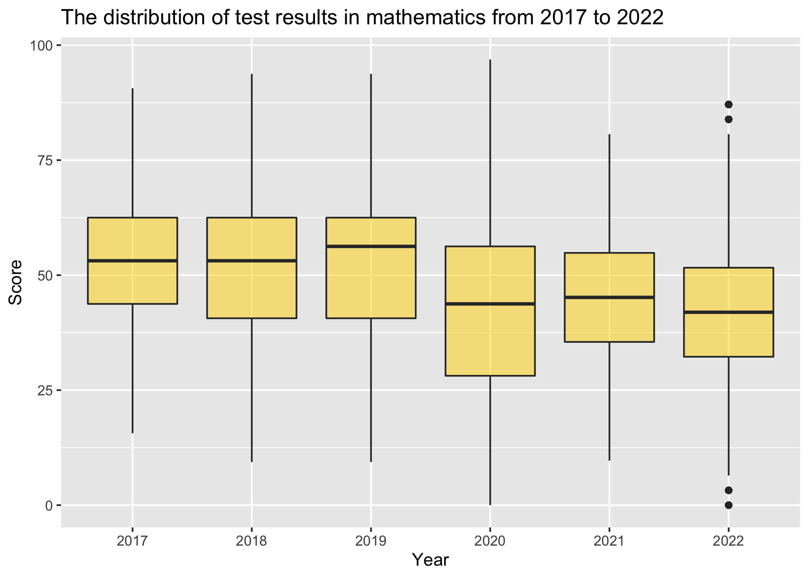
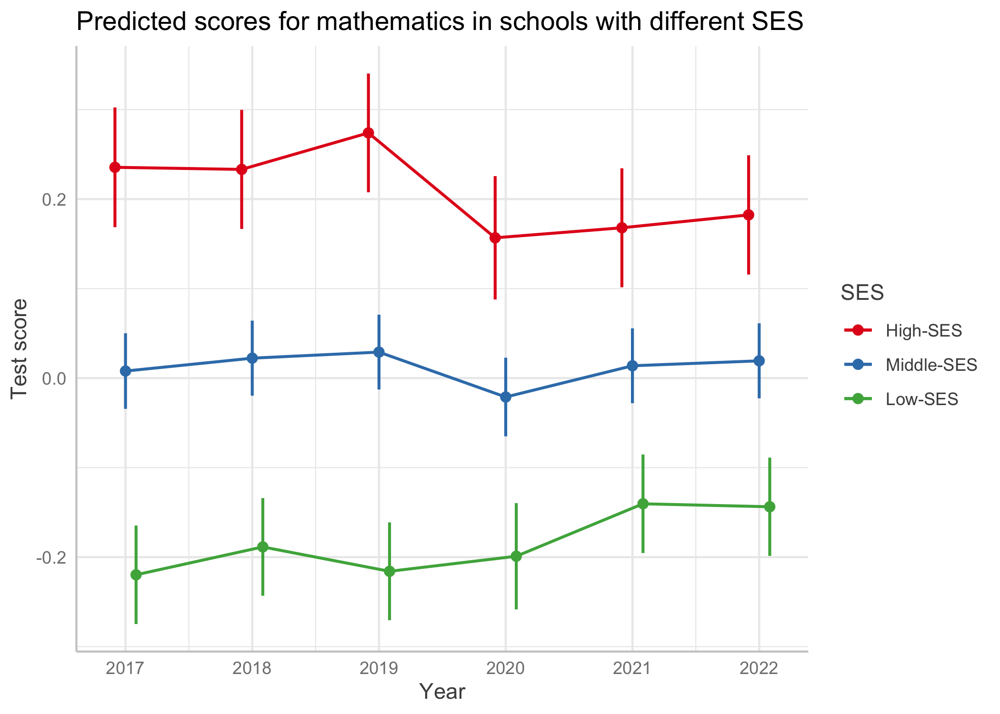

How Did the COVID-19 Pandemic Influence Students' Academic Achievement?
=======================================================================

Please note that the hidden sections provide detailed information on data preparation. You may explore these sections if you are extremely interested in technical details.

Key Results
-----------

-   The data reveal an unexpected pattern: academic achievement during the pandemic increased among schools with low socioeconomic status, while schools with high socioeconomic status experienced a decline. This led to a reduction in inequality between schools.
-   Overall, the impact of the pandemic on academic achievement in the region is relatively small.

Preparing individual data for the analysis
------------------------------------------

In this analysis, I use the results of the state exam at the end of the 9th grade in reading and mathematics as indicators of academic achievement.

<details> <summary>Open this section</summary>

Data check. The data is numeric and free of typos or unnecessary characters. There are no duplicate student records in the data.

``` r
library(readxl)
ind_data <- read_excel("ind_data.xlsx", na="NA")

str(ind_data)
```

    ## tibble [148,423 × 5] (S3: tbl_df/tbl/data.frame)
    ##  $ year   : num [1:148423] 2022 2022 2022 2022 2022 ...
    ##  $ schl_id: num [1:148423] 910001 910001 910001 910001 910002 ...
    ##  $ stud_id: num [1:148423] 2201460 2220542 2213537 2226928 2225580 ...
    ##  $ rus    : num [1:148423] 25 23 20 29 26 4 22 16 23 23 ...
    ##  $ math   : num [1:148423] 10 10 10 13 12 7 8 11 8 9 ...

``` r
sapply(ind_data, function(x) sum(is.na(x)))
```

    ##    year schl_id stud_id     rus    math 
    ##       0       0       0    2648    1852

``` r
sapply(ind_data, function(x) sum(duplicated(x)))
```

    ##    year schl_id stud_id     rus    math 
    ##  148417  147455       0  148382  148389

To compare test results across different years, I divide each score by the maximum possible score for that year to calculate the percentage of test completion. This is necessary because maximum scores vary by year.

``` r
max_scores <- data.frame(year = c(2017, 2018, 2019, 2020, 2021, 2022),
                          rus = c(39, 39, 39, 33, 33, 33),
                          math = c(32, 32, 32, 32, 31, 31))
print(max_scores)
```

    ##   year rus math
    ## 1 2017  39   32
    ## 2 2018  39   32
    ## 3 2019  39   32
    ## 4 2020  33   32
    ## 5 2021  33   31
    ## 6 2022  33   31

``` r
library(dplyr)
ind_data <- left_join(ind_data, max_scores, by = "year")
ind_data <- ind_data %>%
  mutate(rus_perc = rus.x / rus.y * 100,
         math_perc = math.x / math.y * 100)
```

The descriptive statistics reveal zero scores in the data, indicating possible outliers. This is especially suspicious in the reading test, where achievements are typically high.

``` r
library(tidyr)
ind_data_long <- ind_data %>% 
  select(year, schl_id, stud_id, rus_perc, math_perc) %>%
  pivot_longer(cols = rus_perc:math_perc, names_to = "subject", values_to = "score") %>%
  mutate(subject = case_when(
    subject == "rus_perc" ~ "rus",
    subject == "math_perc" ~ "math",
    TRUE ~ subject))

descriptives <- ind_data_long %>%
  group_by(year, subject) %>%
  summarise(n = sum(!is.na(score)),
            mean = round(mean(score, na.rm = TRUE)), 
            sd = round(sd(score, na.rm = TRUE)), 
            min = round(min(score, na.rm = TRUE)), 
            max = round(max(score, na.rm = TRUE))) %>%
  arrange(factor(subject, levels = c("rus", "math")), year) %>%
  select(-subject)

library(kableExtra)
kable(descriptives, digits = 0, align = c("l", "c", "c", "c", "c"), col.names = c("Year", "N", "Mean", "Std.d.", "Min", "Max")) %>%
  kable_styling(full_width = F) %>%
  pack_rows("Reading", 1, 6) %>%
  pack_rows("Math", 7, 12) %>%
  add_header_above(c("Descriptive statistics for test results
                     in the region from 2017 to 2022"=6))
```

<table class="table" style="width: auto !important; margin-left: auto; margin-right: auto;">
<thead>
<tr>
<th style="border-bottom:hidden;padding-bottom:0; padding-left:3px;padding-right:3px;text-align: center; " colspan="6">
Descriptive statistics for test results<br> in the region from 2017 to 2022

</th>
</tr>
<tr>
<th style="text-align:left;">
Year
</th>
<th style="text-align:center;">
N
</th>
<th style="text-align:center;">
Mean
</th>
<th style="text-align:center;">
Std.d.
</th>
<th style="text-align:center;">
Min
</th>
<th style="text-align:left;">
Max
</th>
</tr>
</thead>
<tbody>
<tr grouplength="6">
<td colspan="6" style="border-bottom: 1px solid;">
<strong>Reading</strong>
</td>
</tr>
<tr>
<td style="text-align:left;padding-left: 2em;" indentlevel="1">
2017
</td>
<td style="text-align:center;">
23541
</td>
<td style="text-align:center;">
79
</td>
<td style="text-align:center;">
15
</td>
<td style="text-align:center;">
0
</td>
<td style="text-align:left;">
100
</td>
</tr>
<tr>
<td style="text-align:left;padding-left: 2em;" indentlevel="1">
2018
</td>
<td style="text-align:center;">
25723
</td>
<td style="text-align:center;">
77
</td>
<td style="text-align:center;">
15
</td>
<td style="text-align:center;">
0
</td>
<td style="text-align:left;">
100
</td>
</tr>
<tr>
<td style="text-align:left;padding-left: 2em;" indentlevel="1">
2019
</td>
<td style="text-align:center;">
27349
</td>
<td style="text-align:center;">
80
</td>
<td style="text-align:center;">
15
</td>
<td style="text-align:center;">
0
</td>
<td style="text-align:left;">
100
</td>
</tr>
<tr>
<td style="text-align:left;padding-left: 2em;" indentlevel="1">
2020
</td>
<td style="text-align:center;">
14416
</td>
<td style="text-align:center;">
70
</td>
<td style="text-align:center;">
16
</td>
<td style="text-align:center;">
0
</td>
<td style="text-align:left;">
100
</td>
</tr>
<tr>
<td style="text-align:left;padding-left: 2em;" indentlevel="1">
2021
</td>
<td style="text-align:center;">
27485
</td>
<td style="text-align:center;">
75
</td>
<td style="text-align:center;">
14
</td>
<td style="text-align:center;">
0
</td>
<td style="text-align:left;">
100
</td>
</tr>
<tr>
<td style="text-align:left;padding-left: 2em;" indentlevel="1">
2022
</td>
<td style="text-align:center;">
27261
</td>
<td style="text-align:center;">
76
</td>
<td style="text-align:center;">
14
</td>
<td style="text-align:center;">
0
</td>
<td style="text-align:left;">
100
</td>
</tr>
<tr grouplength="6">
<td colspan="6" style="border-bottom: 1px solid;">
<strong>Math</strong>
</td>
</tr>
<tr>
<td style="text-align:left;padding-left: 2em;" indentlevel="1">
2017
</td>
<td style="text-align:center;">
23549
</td>
<td style="text-align:center;">
54
</td>
<td style="text-align:center;">
15
</td>
<td style="text-align:center;">
0
</td>
<td style="text-align:left;">
100
</td>
</tr>
<tr>
<td style="text-align:left;padding-left: 2em;" indentlevel="1">
2018
</td>
<td style="text-align:center;">
25959
</td>
<td style="text-align:center;">
53
</td>
<td style="text-align:center;">
18
</td>
<td style="text-align:center;">
0
</td>
<td style="text-align:left;">
100
</td>
</tr>
<tr>
<td style="text-align:left;padding-left: 2em;" indentlevel="1">
2019
</td>
<td style="text-align:center;">
27637
</td>
<td style="text-align:center;">
54
</td>
<td style="text-align:center;">
18
</td>
<td style="text-align:center;">
0
</td>
<td style="text-align:left;">
100
</td>
</tr>
<tr>
<td style="text-align:left;padding-left: 2em;" indentlevel="1">
2020
</td>
<td style="text-align:center;">
14054
</td>
<td style="text-align:center;">
42
</td>
<td style="text-align:center;">
19
</td>
<td style="text-align:center;">
0
</td>
<td style="text-align:left;">
100
</td>
</tr>
<tr>
<td style="text-align:left;padding-left: 2em;" indentlevel="1">
2021
</td>
<td style="text-align:center;">
27476
</td>
<td style="text-align:center;">
46
</td>
<td style="text-align:center;">
15
</td>
<td style="text-align:center;">
0
</td>
<td style="text-align:left;">
100
</td>
</tr>
<tr>
<td style="text-align:left;padding-left: 2em;" indentlevel="1">
2022
</td>
<td style="text-align:center;">
27896
</td>
<td style="text-align:center;">
44
</td>
<td style="text-align:center;">
17
</td>
<td style="text-align:center;">
0
</td>
<td style="text-align:left;">
100
</td>
</tr>
</tbody>
</table>
Box plot graphs can help identify outliers and suspicious values in the data. Visual analysis confirms that in the reading test students have unusually low scores despite high averages, while in the mathematics test they gain both excessively low and high scores.

``` r
library(ggplot2)
ggplot(ind_data_long[ind_data_long$subject == "rus", ], aes(x = as.factor(year), y = score)) +
  geom_boxplot(fill = "#7cb3e6", alpha=0.8) +
  labs(title = "Distribution of scores in reading from 2017 to 2022", x = "Year", y = "Score")
```


``` r
ggplot(ind_data_long[ind_data_long$subject == "math", ], aes(x = as.factor(year), y = score)) +
  geom_boxplot(fill = "gold1", alpha=0.5) +
  labs(title = "Distribution of scores in mathematics from 2017 to 2022", x = "Year", y = "Score")
```


I use Tukey's method to remove outliers for each subject and year.

``` r
outlier_counts <- ind_data_long %>%
  group_by(year, subject) %>%
  summarise(n = sum(!is.na(score)),
            outliers = sum(score < quantile(score, 0.25, na.rm = TRUE) - 1.5*IQR(score, na.rm = TRUE) | 
                             score > quantile(score, 0.75, na.rm = TRUE) + 1.5*IQR(score, na.rm = TRUE),
                           na.rm = TRUE))

outlier_counts %>%
  group_by(subject) %>%
  summarise(n=sum(n), outliers=sum(outliers))
```

    ## # A tibble: 2 × 3
    ##   subject      n outliers
    ##   <chr>    <int>    <int>
    ## 1 math    146571     2747
    ## 2 rus     145775     1418

I removed 4165 outliers from a total of 292346 observations, which accounts for approximately 1% of the data.

``` r
replace_outliers_with_na <- function(x, na.rm = TRUE) {
  qnt <- quantile(x, probs = c(.25, .75), na.rm = na.rm)
  H <- 1.5 * IQR(x, na.rm = na.rm)
  x[x < (qnt[1] - H) | x > (qnt[2] + H)] <- NA
  return(x)}

ind_data_clean <- ind_data_long %>% 
  group_by(year, subject) %>% 
  mutate(score = replace_outliers_with_na(score)) %>% 
  ungroup()

sapply(ind_data_long, function(x) sum(is.na(x)))
```

    ##    year schl_id stud_id subject   score 
    ##       0       0       0       0    4500

``` r
sapply(ind_data_clean, function(x) sum(is.na(x))) 
```

    ##    year schl_id stud_id subject   score 
    ##       0       0       0       0    8665

</details>

Descriptive analysis of individual data
---------------------------------------

<details> <summary>Open this section</summary>

Test results in reading and mathematics demonstrate a decline after 2019, according to the descritive statistics table.

``` r
descriptives <- ind_data_clean %>%
  group_by(year, subject) %>%
  summarise(n = sum(!is.na(score)),
            mean = round(mean(score, na.rm = TRUE)), 
            sd = round(sd(score, na.rm = TRUE)), 
            min = round(min(score, na.rm = TRUE)), 
            max = round(max(score, na.rm = TRUE))) %>%
  arrange(factor(subject, levels = c("rus", "math")), year)%>%
  select(-subject)

kable(descriptives, digits = 0, align = c("l", "c", "c", "c", "c"), col.names = c("Year", "N", "Mean", "Std. dev.", "Min", "Max")) %>%
  kable_styling(full_width = F) %>%
  pack_rows("Reading", 1, 6) %>%
  pack_rows("Mathematics", 7, 12) %>%
  add_header_above(c("Descriptive statistics for test results
                     in the region from 2017 to 2022"=6))
```

<table class="table" style="width: auto !important; margin-left: auto; margin-right: auto;">
<thead>
<tr>
<th style="border-bottom:hidden;padding-bottom:0; padding-left:3px;padding-right:3px;text-align: center; " colspan="6">
Descriptive statistics for test results<br> in the region from 2017 to 2022

</th>
</tr>
<tr>
<th style="text-align:left;">
Year
</th>
<th style="text-align:center;">
N
</th>
<th style="text-align:center;">
Mean
</th>
<th style="text-align:center;">
Std. dev.
</th>
<th style="text-align:center;">
Min
</th>
<th style="text-align:left;">
Max
</th>
</tr>
</thead>
<tbody>
<tr grouplength="6">
<td colspan="6" style="border-bottom: 1px solid;">
<strong>Reading</strong>
</td>
</tr>
<tr>
<td style="text-align:left;padding-left: 2em;" indentlevel="1">
2017
</td>
<td style="text-align:center;">
23453
</td>
<td style="text-align:center;">
79
</td>
<td style="text-align:center;">
15
</td>
<td style="text-align:center;">
38
</td>
<td style="text-align:left;">
100
</td>
</tr>
<tr>
<td style="text-align:left;padding-left: 2em;" indentlevel="1">
2018
</td>
<td style="text-align:center;">
25652
</td>
<td style="text-align:center;">
77
</td>
<td style="text-align:center;">
15
</td>
<td style="text-align:center;">
33
</td>
<td style="text-align:left;">
100
</td>
</tr>
<tr>
<td style="text-align:left;padding-left: 2em;" indentlevel="1">
2019
</td>
<td style="text-align:center;">
26853
</td>
<td style="text-align:center;">
81
</td>
<td style="text-align:center;">
14
</td>
<td style="text-align:center;">
44
</td>
<td style="text-align:left;">
100
</td>
</tr>
<tr>
<td style="text-align:left;padding-left: 2em;" indentlevel="1">
2020
</td>
<td style="text-align:center;">
14122
</td>
<td style="text-align:center;">
71
</td>
<td style="text-align:center;">
14
</td>
<td style="text-align:center;">
30
</td>
<td style="text-align:left;">
100
</td>
</tr>
<tr>
<td style="text-align:left;padding-left: 2em;" indentlevel="1">
2021
</td>
<td style="text-align:center;">
27317
</td>
<td style="text-align:center;">
75
</td>
<td style="text-align:center;">
13
</td>
<td style="text-align:center;">
39
</td>
<td style="text-align:left;">
100
</td>
</tr>
<tr>
<td style="text-align:left;padding-left: 2em;" indentlevel="1">
2022
</td>
<td style="text-align:center;">
26960
</td>
<td style="text-align:center;">
76
</td>
<td style="text-align:center;">
12
</td>
<td style="text-align:center;">
39
</td>
<td style="text-align:left;">
100
</td>
</tr>
<tr grouplength="6">
<td colspan="6" style="border-bottom: 1px solid;">
<strong>Mathematics</strong>
</td>
</tr>
<tr>
<td style="text-align:left;padding-left: 2em;" indentlevel="1">
2017
</td>
<td style="text-align:center;">
23000
</td>
<td style="text-align:center;">
53
</td>
<td style="text-align:center;">
14
</td>
<td style="text-align:center;">
16
</td>
<td style="text-align:left;">
91
</td>
</tr>
<tr>
<td style="text-align:left;padding-left: 2em;" indentlevel="1">
2018
</td>
<td style="text-align:center;">
25487
</td>
<td style="text-align:center;">
53
</td>
<td style="text-align:center;">
17
</td>
<td style="text-align:center;">
9
</td>
<td style="text-align:left;">
94
</td>
</tr>
<tr>
<td style="text-align:left;padding-left: 2em;" indentlevel="1">
2019
</td>
<td style="text-align:center;">
27062
</td>
<td style="text-align:center;">
53
</td>
<td style="text-align:center;">
17
</td>
<td style="text-align:center;">
9
</td>
<td style="text-align:left;">
94
</td>
</tr>
<tr>
<td style="text-align:left;padding-left: 2em;" indentlevel="1">
2020
</td>
<td style="text-align:center;">
14037
</td>
<td style="text-align:center;">
42
</td>
<td style="text-align:center;">
19
</td>
<td style="text-align:center;">
0
</td>
<td style="text-align:left;">
97
</td>
</tr>
<tr>
<td style="text-align:left;padding-left: 2em;" indentlevel="1">
2021
</td>
<td style="text-align:center;">
26630
</td>
<td style="text-align:center;">
45
</td>
<td style="text-align:center;">
13
</td>
<td style="text-align:center;">
10
</td>
<td style="text-align:left;">
81
</td>
</tr>
<tr>
<td style="text-align:left;padding-left: 2em;" indentlevel="1">
2022
</td>
<td style="text-align:center;">
27608
</td>
<td style="text-align:center;">
44
</td>
<td style="text-align:center;">
16
</td>
<td style="text-align:center;">
0
</td>
<td style="text-align:left;">
87
</td>
</tr>
</tbody>
</table>
Analysis of the distribution of scores in reading and mathematics over a 6-year period reveals the following:

-   The reading test consistently exhibits the highest scores, indicating its relative ease. The score distribution is skewed to the left, with a significant number of students scoring above the average.
-   In mathematics, the average percentage of completion is generally lower than in reading. The score distribution is slightly skewed to the right in recent years, suggesting a greater level of difficulty compared to the reading test.

``` r
ggplot(ind_data_clean, aes(x = score, fill = subject)) +
  geom_density(alpha = 0.5) +
  facet_wrap(~ year, ncol = 3) +
  labs(title = "The distribution of test results by subject in each year",
       x = "Score")+
  scale_fill_discrete(name = "Subject", labels = c("Mathematics", "Reading"))
```

 In the separate graphs for each subject, there is a slight decline in the results in 2020. However, reading scores show a recovery after 2020, while there is no similar trend in mathematics. It is worth noting that these data do not provide evidence of a statistically significant effect of the pandemic and only visually illustrate the situation without controlling for other variables.

``` r
ggplot(ind_data_clean[ind_data_clean$subject == "rus", ], aes(x = as.factor(year), y = score)) +
  geom_boxplot(fill = "#7cb3e6", alpha=0.8) +
  labs(title = "The distribution of test results in reading from 2017 to 2022", x = "Year", y = "Score")
```


``` r
ggplot(ind_data_clean[ind_data_clean$subject == "math", ], aes(x = as.factor(year), y = score)) +
  geom_boxplot(fill = "gold1", alpha=0.5) +
  labs(title = "The distribution of test results in mathematics from 2017 to 2022", x = "Year", y = "Score")
```

 </details>

Preparing school data for the analysis
--------------------------------------

At the school level, I unclude data collected from 2017 to 2021, which provides information about the characteristics of the student population in the educational organization. These variables are used as an indicator of the school's socioeconomic status (SES).

<details> <summary>Open this section</summary>

The data file contains accurate numeric entries without typos or unnecessary symbols. It includes 17 contextual variables for schools. Meaningful variables that are consistently measured across years and have few missing values will be selected for further analysis.

``` r
schl_data <- read_excel("schl_dat.xlsx", na="NA")
str(schl_data)
```

    ## tibble [4,855 × 19] (S3: tbl_df/tbl/data.frame)
    ##  $ year   : num [1:4855] 2021 2021 2021 2021 2021 ...
    ##  $ schl_id: num [1:4855] 910001 910002 910003 910004 910005 ...
    ##  $ ses1   : num [1:4855] 6.45 0.72 1.39 1.6 8.93 10 0 3.59 5.45 0 ...
    ##  $ ses2   : num [1:4855] 0 0 1.39 0.4 5.36 0 0 0 0 0 ...
    ##  $ ses3   : num [1:4855] 0 0 0.77 0 0 0 0 0 0 0 ...
    ##  $ ses4   : num [1:4855] 1.61 0.72 1.85 2.4 5.36 0 0 1.8 1.82 0 ...
    ##  $ ses5   : num [1:4855] 59.5 48 27.6 82.6 65.7 ...
    ##  $ ses6   : num [1:4855] 3.23 2.16 3.25 3.61 3.57 0 0 8.38 1.82 0 ...
    ##  $ ses7   : num [1:4855] 25.81 21.58 5.26 11.62 53.57 ...
    ##  $ ses8   : num [1:4855] NA NA NA NA NA NA NA NA NA NA ...
    ##  $ ses9   : num [1:4855] 4.84 12.95 40.65 9.62 5.36 ...
    ##  $ ses10  : num [1:4855] 24.2 25.2 32.6 20.4 37.5 ...
    ##  $ ses11  : num [1:4855] 59.7 41 11.1 30.5 42.9 ...
    ##  $ ses12  : num [1:4855] 4.84 4.32 1.24 3.01 16.07 ...
    ##  $ ses13  : num [1:4855] 1.61 10.79 1.55 4.61 12.5 ...
    ##  $ ses14  : num [1:4855] 6.45 5.04 1.08 0 3.57 0 0 0 0 0 ...
    ##  $ ses15  : num [1:4855] 85.48 5.76 15.92 12.42 14.29 ...
    ##  $ ses16  : num [1:4855] 32 33 0 0 65 110 65 22 90 120 ...
    ##  $ ses17  : num [1:4855] 82 80 50 58 105 150 100 74 140 170 ...

``` r
summary(schl_data)
```

    ##       year         schl_id            ses1             ses2        
    ##  Min.   :2017   Min.   :832002   Min.   :  0.00   Min.   :  0.000  
    ##  1st Qu.:2018   1st Qu.:919207   1st Qu.:  0.00   1st Qu.:  0.000  
    ##  Median :2019   Median :930010   Median :  1.07   Median :  0.000  
    ##  Mean   :2019   Mean   :941988   Mean   :  2.32   Mean   :  2.928  
    ##  3rd Qu.:2020   3rd Qu.:945006   3rd Qu.:  2.86   3rd Qu.:  0.450  
    ##  Max.   :2021   Max.   :999212   Max.   :100.00   Max.   :100.000  
    ##                                  NA's   :46       NA's   :2931     
    ##       ses3             ses4              ses5             ses6       
    ##  Min.   :  0.00   Min.   :  0.000   Min.   :  0.00   Min.   : 0.000  
    ##  1st Qu.:  0.00   1st Qu.:  2.380   1st Qu.: 18.48   1st Qu.: 0.000  
    ##  Median :  0.00   Median :  5.190   Median : 45.13   Median : 1.540  
    ##  Mean   :  1.09   Mean   :  9.452   Mean   : 47.76   Mean   : 3.406  
    ##  3rd Qu.:  0.00   3rd Qu.: 10.420   3rd Qu.: 75.00   3rd Qu.: 4.055  
    ##  Max.   :100.00   Max.   :100.000   Max.   :100.00   Max.   :82.500  
    ##  NA's   :40       NA's   :45        NA's   :2957     NA's   :48      
    ##       ses7              ses8             ses9            ses10       
    ##  Min.   :  0.000   Min.   :  0.00   Min.   :  0.00   Min.   :  0.00  
    ##  1st Qu.:  1.895   1st Qu.: 39.55   1st Qu.:  9.43   1st Qu.: 15.91  
    ##  Median : 11.360   Median : 74.33   Median : 18.39   Median : 21.45  
    ##  Mean   : 17.227   Mean   : 64.27   Mean   : 27.66   Mean   : 23.23  
    ##  3rd Qu.: 26.670   3rd Qu.: 91.10   3rd Qu.: 40.78   3rd Qu.: 28.86  
    ##  Max.   :100.000   Max.   :100.00   Max.   :100.00   Max.   :100.00  
    ##  NA's   :49        NA's   :963      NA's   :3906     NA's   :49      
    ##      ses11           ses12             ses13            ses14       
    ##  Min.   : 0.00   Min.   :  0.000   Min.   :  0.00   Min.   : 0.000  
    ##  1st Qu.:14.94   1st Qu.:  0.000   1st Qu.:  4.03   1st Qu.: 0.000  
    ##  Median :25.87   Median :  0.250   Median : 17.07   Median : 0.360  
    ##  Mean   :28.19   Mean   :  2.539   Mean   : 25.19   Mean   : 1.564  
    ##  3rd Qu.:38.46   3rd Qu.:  2.750   3rd Qu.: 37.08   3rd Qu.: 1.670  
    ##  Max.   :90.91   Max.   :100.000   Max.   :100.00   Max.   :76.720  
    ##  NA's   :48      NA's   :49        NA's   :49       NA's   :3906    
    ##      ses15            ses16            ses17      
    ##  Min.   :  0.00   Min.   :  0.00   Min.   :  0.0  
    ##  1st Qu.:  0.00   1st Qu.:  0.00   1st Qu.: 14.0  
    ##  Median : 14.55   Median : 16.00   Median :125.0  
    ##  Mean   : 31.85   Mean   : 21.27   Mean   :203.6  
    ##  3rd Qu.: 61.02   3rd Qu.: 35.75   3rd Qu.:380.0  
    ##  Max.   :100.00   Max.   :120.00   Max.   :723.0  
    ##  NA's   :3906     NA's   :3905     NA's   :3905

``` r
schl_data %>%
  group_by(year) %>%
  summarise(n = sum(!is.na(schl_id)),
            across(ses1:ses17, list(miss = ~sum(is.na(.)))))
```

    ## # A tibble: 5 × 19
    ##    year     n ses1_miss ses2_miss ses3_miss ses4_miss ses5_miss ses6_miss
    ##   <dbl> <int>     <int>     <int>     <int>     <int>     <int>     <int>
    ## 1  2017   967        16       967        14        16       967        17
    ## 2  2018   985        14       985        13        13       985        14
    ## 3  2019   972         8       972         6         8       972         9
    ## 4  2020   973         1         1         1         1        14         1
    ## 5  2021   958         7         6         6         7        19         7
    ## # … with 11 more variables: ses7_miss <int>, ses8_miss <int>, ses9_miss <int>,
    ## #   ses10_miss <int>, ses11_miss <int>, ses12_miss <int>, ses13_miss <int>,
    ## #   ses14_miss <int>, ses15_miss <int>, ses16_miss <int>, ses17_miss <int>

``` r
schl_ses <- select(schl_data, -"ses2", -"ses5",-"ses6", -"ses9", -"ses14", -"ses15", -"ses16", -"ses17")
```

After removing variables with a large number of missing values, the remaining data in the database are as follows:

-   ses1: Proportion of students on the school behavior watchlist
-   ses3: Proportion of students learning Russian language for less than one year
-   ses4: Proportion of students with special needs (disabled children)
-   ses7: Proportion of students with one or both parents unemployed
-   ses8: Proportion of students with both parents without higher education
-   ses10: Proportion of students from single-parent families
-   ses11: Proportion of students from large families
-   ses12: Proportion of students from socially vulnerable families
-   ses13: Proportion of students from low-income families

I calculate the averages of these variables from 2017 to 2021 to provide an overview of the socioeconomic characteristics of the student population during the study period.

``` r
ses_mean <- schl_ses %>%
  group_by(schl_id) %>%
  summarise(across(starts_with("ses"), 
                   list(m = mean, v = var), 
                   na.rm = TRUE))
```

Based on these data, schools with outliers in the means and variances of SES variables, indicating extreme values and significant changes in their student population over the past 5 years, are identified. These schools likely have data errors and are excluded from the analysis.

``` r
ses_mean_clean <- ses_mean %>% 
  mutate_at(vars(starts_with("ses")), replace_outliers_with_na) %>% 
  ungroup()

library(stringr)
ses_mean_clean <- ses_mean_clean %>%
  mutate(across(ends_with("_m"), ~ ifelse(is.na(get(str_replace(cur_column(), "_m$", "_v"))), NA, .))) %>%
  ungroup()

sapply(ses_mean, function(x) sum(is.na(x)))
```

    ## schl_id  ses1_m  ses1_v  ses3_m  ses3_v  ses4_m  ses4_v  ses7_m  ses7_v  ses8_m 
    ##       0       6      14       6      14       6      14       6      14       7 
    ##  ses8_v ses10_m ses10_v ses11_m ses11_v ses12_m ses12_v ses13_m ses13_v 
    ##      19       6      14       6      14       6      14       6      14

``` r
sapply(ses_mean_clean, function(x) sum(is.na(x)))
```

    ## schl_id  ses1_m  ses1_v  ses3_m  ses3_v  ses4_m  ses4_v  ses7_m  ses7_v  ses8_m 
    ##       0     161     146     244     244     180     142     128     120     122 
    ##  ses8_v ses10_m ses10_v ses11_m ses11_v ses12_m ses12_v ses13_m ses13_v 
    ##     122     126     106     119     117     200     179     158     140

</details>

Descriptive analysis of school variables
----------------------------------------

<details> <summary>Open this section</summary>

The key findings from the descriptive statistics:

-   Schools in the region vary significantly in the proportion of students from families without higher education and from low-income families.
-   There are smaller differences between schools in terms of students with disabilities, from unemployed families, from single-parent families and from large families.
-   The variables for students on school behavior watchlist, students studying Russian language for less than a year, and students from socially vulnerable families, have low variance and close to zero mean values. These variables will be excluded from the database.

``` r
ses_mean_clean <- select(ses_mean_clean, -ends_with("v"))

library(vtable)
ses_mean_clean %>%
select(-schl_id) %>%
st(out="kable", summ=c('notNA(x)','mean(x)', 'sd(x)', 'min(x)', 'max(x)'), title="Descriptive Statistics of Average School Data in 2017-2021",
labels=c("ses1: Proportion of students on the school behavior watchlist",
"ses3: Proportion of students learning Russian language for less than one year",
"ses4: Proportion of students with special needs (disabled children)",
"ses7: Proportion of students with one or both parents unemployed",
"ses8: Proportion of students with both parents without higher education",
"ses10: Proportion of students from single-parent families",
"ses11: Proportion of students from large families",
"ses12: Proportion of students from socially vulnerable families",
"ses13: Proportion of students from low-income families")) %>%
  kableExtra::kable_styling()
```

<table class="table" style="margin-left: auto; margin-right: auto;">
<caption>
Descriptive Statistics of Average School Data in 2017-2021
</caption>
<thead>
<tr>
<th style="text-align:left;">
Variable
</th>
<th style="text-align:left;">
NotNA
</th>
<th style="text-align:left;">
Mean
</th>
<th style="text-align:left;">
Sd
</th>
<th style="text-align:left;">
Min
</th>
<th style="text-align:left;">
Max
</th>
</tr>
</thead>
<tbody>
<tr>
<td style="text-align:left;">
ses1: Proportion of students on the school behavior watchlist
</td>
<td style="text-align:left;">
839
</td>
<td style="text-align:left;">
1.5
</td>
<td style="text-align:left;">
1.4
</td>
<td style="text-align:left;">
0
</td>
<td style="text-align:left;">
6.3
</td>
</tr>
<tr>
<td style="text-align:left;">
ses3: Proportion of students learning Russian language for less than one year
</td>
<td style="text-align:left;">
756
</td>
<td style="text-align:left;">
0
</td>
<td style="text-align:left;">
0
</td>
<td style="text-align:left;">
0
</td>
<td style="text-align:left;">
0
</td>
</tr>
<tr>
<td style="text-align:left;">
ses4: Proportion of students with special needs (disabled children)
</td>
<td style="text-align:left;">
820
</td>
<td style="text-align:left;">
5.4
</td>
<td style="text-align:left;">
4.3
</td>
<td style="text-align:left;">
0
</td>
<td style="text-align:left;">
21
</td>
</tr>
<tr>
<td style="text-align:left;">
ses7: Proportion of students with one or both parents unemployed
</td>
<td style="text-align:left;">
872
</td>
<td style="text-align:left;">
14
</td>
<td style="text-align:left;">
14
</td>
<td style="text-align:left;">
0
</td>
<td style="text-align:left;">
60
</td>
</tr>
<tr>
<td style="text-align:left;">
ses8: Proportion of students with both parents without higher education
</td>
<td style="text-align:left;">
878
</td>
<td style="text-align:left;">
65
</td>
<td style="text-align:left;">
31
</td>
<td style="text-align:left;">
0
</td>
<td style="text-align:left;">
100
</td>
</tr>
<tr>
<td style="text-align:left;">
ses10: Proportion of students from single-parent families
</td>
<td style="text-align:left;">
874
</td>
<td style="text-align:left;">
22
</td>
<td style="text-align:left;">
8.3
</td>
<td style="text-align:left;">
0
</td>
<td style="text-align:left;">
45
</td>
</tr>
<tr>
<td style="text-align:left;">
ses11: Proportion of students from large families
</td>
<td style="text-align:left;">
881
</td>
<td style="text-align:left;">
26
</td>
<td style="text-align:left;">
14
</td>
<td style="text-align:left;">
0
</td>
<td style="text-align:left;">
72
</td>
</tr>
<tr>
<td style="text-align:left;">
ses12: Proportion of students from socially vulnerable families
</td>
<td style="text-align:left;">
800
</td>
<td style="text-align:left;">
1
</td>
<td style="text-align:left;">
1.5
</td>
<td style="text-align:left;">
0
</td>
<td style="text-align:left;">
7.6
</td>
</tr>
<tr>
<td style="text-align:left;">
ses13: Proportion of students from low-income families
</td>
<td style="text-align:left;">
842
</td>
<td style="text-align:left;">
20
</td>
<td style="text-align:left;">
20
</td>
<td style="text-align:left;">
0
</td>
<td style="text-align:left;">
88
</td>
</tr>
</tbody>
</table>
``` r
ses_mean_clean <- select(ses_mean_clean, -"ses1_m", -"ses3_m", -"ses12_m") 
```

</details>

Preparing final database for the analysis
-----------------------------------------

<details> <summary>Open this section</summary>

The individual student data have been merged with the school-level characteristics. Next, I have examined the relationship between the remaining school-level variables and the test results of the students.

``` r
data_ind_level <- merge(ind_data_clean, ses_mean_clean, by = "schl_id")

library(corrplot)
library(Hmisc)

rus <- subset(data_ind_level[, 5:11], data_ind_level$subject == "rus")
corr_r <- cor(rus, use = "pairwise.complete.obs", method="pearson")
testRes = rcorr(as.matrix(rus))
corrplot(corr_r, p.mat = testRes$p, method = "ellipse",
         addCoef.col = "black",
         number.cex = 0.75, sig.level = 0.05,
         tl.col = "black", title="Reading")
```


``` r
math <- subset(data_ind_level[, 5:11], data_ind_level$subject == "math")
corr_m <- cor(math, use = "pairwise.complete.obs", method="pearson")
testRes <- rcorr(as.matrix(math))
corrplot(corr_m, p.mat = testRes$p, method = "ellipse",
         addCoef.col = "black", sig.level = 0.05,
         number.cex = 0.75,
         tl.col = "black", title="Mathematics", title.cex = 0.3)
```

 The plot shows a strong negative correlation between the proportion of students from families where both parents do not have a higher education and test results. This finding is consistent with existing research that emphasizes the strong predictive power of parental education for academic achievement and its critical role in determining socioeconomic status (SES). Therefore, this variable will serve as the primary indicator of school SES. Other variables will be included in the models as control factors, with caution taken to check for multicollinearity.

</details>

The impact of the COVID-19 pandemic on test results
---------------------------------------------------

Multilevel regression modeling was used to investigate the impact of the COVID-19 pandemic on academic achievement in the region. The analysis involved a three-level data structure: students at the first level, examination year at the second level, and schools at the third level. The proportion of children from families where both parents lack higher education, averaged from 2017 to 2021, was used as a measure of school socioeconomic status. Additional student population characteristics were included as control variables.

Separate regression models were conducted for each subject. The first model examined overall differences in results across the study years, without assuming a differential pandemic effect. The second model included an interaction term to assess the variations in results between years for schools with different SES levels. The random intercept and fixed slope model were employed as the best fit for the data.

``` r
library(sjstats)
library(sjPlot)
library(dplyr)

ses_mean_clean <- mutate(ses_mean_clean, 
                         ses4_std = scale(ses4_m),
                         ses7_std = scale(ses7_m),
                         SES_std = scale(ses8_m),
                         ses10_std = scale(ses10_m),
                         ses11_std = scale(ses11_m),
                         ses13_std = scale(ses13_m))

data_ind_level <- inner_join(data_ind_level, ses_mean_clean %>% 
select(schl_id, ses4_std, ses7_std, ses10_std, ses11_std, ses13_std, SES_std), by = "schl_id")

data_ind_level <- data_ind_level  %>% 
  group_by(year, subject) %>%
  mutate(score_std = scale(score))
data_ind_level$year_f <- relevel(as.factor(data_ind_level$year), ref="2020")

library(lme4)
library(ggeffects)
library(ggplot2)
library(performance)

rus_mod1 <- lmer(score_std ~ 1 + year_f + SES_std + ses4_std + ses7_std + ses10_std + ses11_std + ses13_std + (1 | schl_id/year), data = data_ind_level, subset = subject == "rus")
check_collinearity(rus_mod1)
```

    ## # Check for Multicollinearity
    ## 
    ## Low Correlation
    ## 
    ##       Term  VIF   VIF 95% CI Increased SE Tolerance Tolerance 95% CI
    ##     year_f 1.00 [1.00, 3.47]         1.00      1.00     [0.29, 1.00]
    ##    SES_std 2.63 [2.61, 2.66]         1.62      0.38     [0.38, 0.38]
    ##   ses4_std 1.48 [1.46, 1.49]         1.21      0.68     [0.67, 0.68]
    ##   ses7_std 1.59 [1.57, 1.60]         1.26      0.63     [0.63, 0.64]
    ##  ses10_std 1.18 [1.17, 1.19]         1.09      0.85     [0.84, 0.85]
    ##  ses11_std 2.18 [2.16, 2.20]         1.48      0.46     [0.45, 0.46]
    ##  ses13_std 1.71 [1.70, 1.73]         1.31      0.58     [0.58, 0.59]

``` r
rus_mod2 <- lmer(score_std ~ 1 + year_f*SES_std + ses4_std + ses7_std + ses10_std + ses11_std + ses13_std + (1 | schl_id/year), data = data_ind_level, subset = subject == "rus")

math_mod1 <- lmer(score_std ~ 1 + year_f + SES_std + ses4_std + ses7_std + ses10_std + ses11_std + ses13_std + (1 | schl_id/year), data = data_ind_level, subset = subject == "math")
check_collinearity(math_mod1)
```

    ## # Check for Multicollinearity
    ## 
    ## Low Correlation
    ## 
    ##       Term  VIF   VIF 95% CI Increased SE Tolerance Tolerance 95% CI
    ##     year_f 1.00 [1.00, 1.41]         1.00      1.00     [0.71, 1.00]
    ##    SES_std 2.63 [2.61, 2.66]         1.62      0.38     [0.38, 0.38]
    ##   ses4_std 1.47 [1.46, 1.48]         1.21      0.68     [0.67, 0.69]
    ##   ses7_std 1.58 [1.57, 1.60]         1.26      0.63     [0.63, 0.64]
    ##  ses10_std 1.18 [1.17, 1.19]         1.09      0.85     [0.84, 0.85]
    ##  ses11_std 2.18 [2.16, 2.20]         1.48      0.46     [0.45, 0.46]
    ##  ses13_std 1.71 [1.70, 1.72]         1.31      0.58     [0.58, 0.59]

``` r
math_mod2 <- lmer(score_std ~ 1 + year_f*SES_std + + ses4_std + ses7_std + ses10_std + ses11_std + ses13_std + (1 | schl_id/year), data = data_ind_level, subset = subject == "math")
```

In the models below, the students' test results were compared to the reference year of 2020, when remote learning was implemented. Overall, there were minimal differences in test results across all years, including the year of the pandemic. While there was a statistically significant increase in math scores after the pandemic, the effect size was negligible, indicating a lack of substantial improvement compared to previous years. **On average, the COVID-19 pandemic did not have a significant impact on academic achievement in the region.**

``` r
tab_model(rus_mod1, rus_mod2, dv.labels = c("Reading", "Reading (with interaction)"), show.aic = TRUE, show.aicc = TRUE, show.loglik = TRUE)
```

<table style="border-collapse:collapse; border:none;">
<tr>
<th style="border-top: double; text-align:center; font-style:normal; font-weight:bold; padding:0.2cm;  text-align:left; ">
 
</th>
<th colspan="3" style="border-top: double; text-align:center; font-style:normal; font-weight:bold; padding:0.2cm; ">
Reading
</th>
<th colspan="3" style="border-top: double; text-align:center; font-style:normal; font-weight:bold; padding:0.2cm; ">
Reading (with interaction)
</th>
</tr>
<tr>
<td style=" text-align:center; border-bottom:1px solid; font-style:italic; font-weight:normal;  text-align:left; ">
Predictors
</td>
<td style=" text-align:center; border-bottom:1px solid; font-style:italic; font-weight:normal;  ">
Estimates
</td>
<td style=" text-align:center; border-bottom:1px solid; font-style:italic; font-weight:normal;  ">
CI
</td>
<td style=" text-align:center; border-bottom:1px solid; font-style:italic; font-weight:normal;  ">
p
</td>
<td style=" text-align:center; border-bottom:1px solid; font-style:italic; font-weight:normal;  ">
Estimates
</td>
<td style=" text-align:center; border-bottom:1px solid; font-style:italic; font-weight:normal;  ">
CI
</td>
<td style=" text-align:center; border-bottom:1px solid; font-style:italic; font-weight:normal;  col7">
p
</td>
</tr>
<tr>
<td style=" padding:0.2cm; text-align:left; vertical-align:top; text-align:left; ">
(Intercept)
</td>
<td style=" padding:0.2cm; text-align:left; vertical-align:top; text-align:center;  ">
-0.24
</td>
<td style=" padding:0.2cm; text-align:left; vertical-align:top; text-align:center;  ">
-0.28 – -0.21
</td>
<td style=" padding:0.2cm; text-align:left; vertical-align:top; text-align:center;  ">
<strong>&lt;0.001</strong>
</td>
<td style=" padding:0.2cm; text-align:left; vertical-align:top; text-align:center;  ">
-0.18
</td>
<td style=" padding:0.2cm; text-align:left; vertical-align:top; text-align:center;  ">
-0.22 – -0.13
</td>
<td style=" padding:0.2cm; text-align:left; vertical-align:top; text-align:center;  col7">
<strong>&lt;0.001</strong>
</td>
</tr>
<tr>
<td style=" padding:0.2cm; text-align:left; vertical-align:top; text-align:left; ">
year f \[2017\]
</td>
<td style=" padding:0.2cm; text-align:left; vertical-align:top; text-align:center;  ">
0.00
</td>
<td style=" padding:0.2cm; text-align:left; vertical-align:top; text-align:center;  ">
-0.03 – 0.04
</td>
<td style=" padding:0.2cm; text-align:left; vertical-align:top; text-align:center;  ">
0.880
</td>
<td style=" padding:0.2cm; text-align:left; vertical-align:top; text-align:center;  ">
-0.09
</td>
<td style=" padding:0.2cm; text-align:left; vertical-align:top; text-align:center;  ">
-0.13 – -0.04
</td>
<td style=" padding:0.2cm; text-align:left; vertical-align:top; text-align:center;  col7">
<strong>&lt;0.001</strong>
</td>
</tr>
<tr>
<td style=" padding:0.2cm; text-align:left; vertical-align:top; text-align:left; ">
year f \[2018\]
</td>
<td style=" padding:0.2cm; text-align:left; vertical-align:top; text-align:center;  ">
0.01
</td>
<td style=" padding:0.2cm; text-align:left; vertical-align:top; text-align:center;  ">
-0.02 – 0.05
</td>
<td style=" padding:0.2cm; text-align:left; vertical-align:top; text-align:center;  ">
0.423
</td>
<td style=" padding:0.2cm; text-align:left; vertical-align:top; text-align:center;  ">
-0.07
</td>
<td style=" padding:0.2cm; text-align:left; vertical-align:top; text-align:center;  ">
-0.11 – -0.03
</td>
<td style=" padding:0.2cm; text-align:left; vertical-align:top; text-align:center;  col7">
<strong>0.002</strong>
</td>
</tr>
<tr>
<td style=" padding:0.2cm; text-align:left; vertical-align:top; text-align:left; ">
year f \[2019\]
</td>
<td style=" padding:0.2cm; text-align:left; vertical-align:top; text-align:center;  ">
0.01
</td>
<td style=" padding:0.2cm; text-align:left; vertical-align:top; text-align:center;  ">
-0.02 – 0.05
</td>
<td style=" padding:0.2cm; text-align:left; vertical-align:top; text-align:center;  ">
0.368
</td>
<td style=" padding:0.2cm; text-align:left; vertical-align:top; text-align:center;  ">
-0.08
</td>
<td style=" padding:0.2cm; text-align:left; vertical-align:top; text-align:center;  ">
-0.12 – -0.03
</td>
<td style=" padding:0.2cm; text-align:left; vertical-align:top; text-align:center;  col7">
<strong>&lt;0.001</strong>
</td>
</tr>
<tr>
<td style=" padding:0.2cm; text-align:left; vertical-align:top; text-align:left; ">
year f \[2021\]
</td>
<td style=" padding:0.2cm; text-align:left; vertical-align:top; text-align:center;  ">
0.01
</td>
<td style=" padding:0.2cm; text-align:left; vertical-align:top; text-align:center;  ">
-0.02 – 0.04
</td>
<td style=" padding:0.2cm; text-align:left; vertical-align:top; text-align:center;  ">
0.504
</td>
<td style=" padding:0.2cm; text-align:left; vertical-align:top; text-align:center;  ">
-0.04
</td>
<td style=" padding:0.2cm; text-align:left; vertical-align:top; text-align:center;  ">
-0.09 – 0.00
</td>
<td style=" padding:0.2cm; text-align:left; vertical-align:top; text-align:center;  col7">
0.071
</td>
</tr>
<tr>
<td style=" padding:0.2cm; text-align:left; vertical-align:top; text-align:left; ">
year f \[2022\]
</td>
<td style=" padding:0.2cm; text-align:left; vertical-align:top; text-align:center;  ">
0.02
</td>
<td style=" padding:0.2cm; text-align:left; vertical-align:top; text-align:center;  ">
-0.01 – 0.05
</td>
<td style=" padding:0.2cm; text-align:left; vertical-align:top; text-align:center;  ">
0.291
</td>
<td style=" padding:0.2cm; text-align:left; vertical-align:top; text-align:center;  ">
-0.03
</td>
<td style=" padding:0.2cm; text-align:left; vertical-align:top; text-align:center;  ">
-0.07 – 0.02
</td>
<td style=" padding:0.2cm; text-align:left; vertical-align:top; text-align:center;  col7">
0.232
</td>
</tr>
<tr>
<td style=" padding:0.2cm; text-align:left; vertical-align:top; text-align:left; ">
SES std
</td>
<td style=" padding:0.2cm; text-align:left; vertical-align:top; text-align:center;  ">
-0.22
</td>
<td style=" padding:0.2cm; text-align:left; vertical-align:top; text-align:center;  ">
-0.27 – -0.18
</td>
<td style=" padding:0.2cm; text-align:left; vertical-align:top; text-align:center;  ">
<strong>&lt;0.001</strong>
</td>
<td style=" padding:0.2cm; text-align:left; vertical-align:top; text-align:center;  ">
-0.15
</td>
<td style=" padding:0.2cm; text-align:left; vertical-align:top; text-align:center;  ">
-0.20 – -0.09
</td>
<td style=" padding:0.2cm; text-align:left; vertical-align:top; text-align:center;  col7">
<strong>&lt;0.001</strong>
</td>
</tr>
<tr>
<td style=" padding:0.2cm; text-align:left; vertical-align:top; text-align:left; ">
ses4 std
</td>
<td style=" padding:0.2cm; text-align:left; vertical-align:top; text-align:center;  ">
-0.03
</td>
<td style=" padding:0.2cm; text-align:left; vertical-align:top; text-align:center;  ">
-0.06 – 0.01
</td>
<td style=" padding:0.2cm; text-align:left; vertical-align:top; text-align:center;  ">
0.137
</td>
<td style=" padding:0.2cm; text-align:left; vertical-align:top; text-align:center;  ">
-0.03
</td>
<td style=" padding:0.2cm; text-align:left; vertical-align:top; text-align:center;  ">
-0.06 – 0.01
</td>
<td style=" padding:0.2cm; text-align:left; vertical-align:top; text-align:center;  col7">
0.136
</td>
</tr>
<tr>
<td style=" padding:0.2cm; text-align:left; vertical-align:top; text-align:left; ">
ses7 std
</td>
<td style=" padding:0.2cm; text-align:left; vertical-align:top; text-align:center;  ">
0.02
</td>
<td style=" padding:0.2cm; text-align:left; vertical-align:top; text-align:center;  ">
-0.02 – 0.06
</td>
<td style=" padding:0.2cm; text-align:left; vertical-align:top; text-align:center;  ">
0.306
</td>
<td style=" padding:0.2cm; text-align:left; vertical-align:top; text-align:center;  ">
0.02
</td>
<td style=" padding:0.2cm; text-align:left; vertical-align:top; text-align:center;  ">
-0.02 – 0.06
</td>
<td style=" padding:0.2cm; text-align:left; vertical-align:top; text-align:center;  col7">
0.290
</td>
</tr>
<tr>
<td style=" padding:0.2cm; text-align:left; vertical-align:top; text-align:left; ">
ses10 std
</td>
<td style=" padding:0.2cm; text-align:left; vertical-align:top; text-align:center;  ">
-0.02
</td>
<td style=" padding:0.2cm; text-align:left; vertical-align:top; text-align:center;  ">
-0.05 – 0.02
</td>
<td style=" padding:0.2cm; text-align:left; vertical-align:top; text-align:center;  ">
0.378
</td>
<td style=" padding:0.2cm; text-align:left; vertical-align:top; text-align:center;  ">
-0.02
</td>
<td style=" padding:0.2cm; text-align:left; vertical-align:top; text-align:center;  ">
-0.05 – 0.02
</td>
<td style=" padding:0.2cm; text-align:left; vertical-align:top; text-align:center;  col7">
0.343
</td>
</tr>
<tr>
<td style=" padding:0.2cm; text-align:left; vertical-align:top; text-align:left; ">
ses11 std
</td>
<td style=" padding:0.2cm; text-align:left; vertical-align:top; text-align:center;  ">
-0.02
</td>
<td style=" padding:0.2cm; text-align:left; vertical-align:top; text-align:center;  ">
-0.07 – 0.03
</td>
<td style=" padding:0.2cm; text-align:left; vertical-align:top; text-align:center;  ">
0.450
</td>
<td style=" padding:0.2cm; text-align:left; vertical-align:top; text-align:center;  ">
-0.02
</td>
<td style=" padding:0.2cm; text-align:left; vertical-align:top; text-align:center;  ">
-0.06 – 0.03
</td>
<td style=" padding:0.2cm; text-align:left; vertical-align:top; text-align:center;  col7">
0.480
</td>
</tr>
<tr>
<td style=" padding:0.2cm; text-align:left; vertical-align:top; text-align:left; ">
ses13 std
</td>
<td style=" padding:0.2cm; text-align:left; vertical-align:top; text-align:center;  ">
-0.00
</td>
<td style=" padding:0.2cm; text-align:left; vertical-align:top; text-align:center;  ">
-0.05 – 0.04
</td>
<td style=" padding:0.2cm; text-align:left; vertical-align:top; text-align:center;  ">
0.947
</td>
<td style=" padding:0.2cm; text-align:left; vertical-align:top; text-align:center;  ">
-0.00
</td>
<td style=" padding:0.2cm; text-align:left; vertical-align:top; text-align:center;  ">
-0.05 – 0.04
</td>
<td style=" padding:0.2cm; text-align:left; vertical-align:top; text-align:center;  col7">
0.933
</td>
</tr>
<tr>
<td style=" padding:0.2cm; text-align:left; vertical-align:top; text-align:left; ">
year f \[2017\] × SES std
</td>
<td style=" padding:0.2cm; text-align:left; vertical-align:top; text-align:center;  ">
</td>
<td style=" padding:0.2cm; text-align:left; vertical-align:top; text-align:center;  ">
</td>
<td style=" padding:0.2cm; text-align:left; vertical-align:top; text-align:center;  ">
</td>
<td style=" padding:0.2cm; text-align:left; vertical-align:top; text-align:center;  ">
-0.10
</td>
<td style=" padding:0.2cm; text-align:left; vertical-align:top; text-align:center;  ">
-0.14 – -0.07
</td>
<td style=" padding:0.2cm; text-align:left; vertical-align:top; text-align:center;  col7">
<strong>&lt;0.001</strong>
</td>
</tr>
<tr>
<td style=" padding:0.2cm; text-align:left; vertical-align:top; text-align:left; ">
year f \[2018\] × SES std
</td>
<td style=" padding:0.2cm; text-align:left; vertical-align:top; text-align:center;  ">
</td>
<td style=" padding:0.2cm; text-align:left; vertical-align:top; text-align:center;  ">
</td>
<td style=" padding:0.2cm; text-align:left; vertical-align:top; text-align:center;  ">
</td>
<td style=" padding:0.2cm; text-align:left; vertical-align:top; text-align:center;  ">
-0.10
</td>
<td style=" padding:0.2cm; text-align:left; vertical-align:top; text-align:center;  ">
-0.13 – -0.06
</td>
<td style=" padding:0.2cm; text-align:left; vertical-align:top; text-align:center;  col7">
<strong>&lt;0.001</strong>
</td>
</tr>
<tr>
<td style=" padding:0.2cm; text-align:left; vertical-align:top; text-align:left; ">
year f \[2019\] × SES std
</td>
<td style=" padding:0.2cm; text-align:left; vertical-align:top; text-align:center;  ">
</td>
<td style=" padding:0.2cm; text-align:left; vertical-align:top; text-align:center;  ">
</td>
<td style=" padding:0.2cm; text-align:left; vertical-align:top; text-align:center;  ">
</td>
<td style=" padding:0.2cm; text-align:left; vertical-align:top; text-align:center;  ">
-0.11
</td>
<td style=" padding:0.2cm; text-align:left; vertical-align:top; text-align:center;  ">
-0.15 – -0.08
</td>
<td style=" padding:0.2cm; text-align:left; vertical-align:top; text-align:center;  col7">
<strong>&lt;0.001</strong>
</td>
</tr>
<tr>
<td style=" padding:0.2cm; text-align:left; vertical-align:top; text-align:left; ">
year f \[2021\] × SES std
</td>
<td style=" padding:0.2cm; text-align:left; vertical-align:top; text-align:center;  ">
</td>
<td style=" padding:0.2cm; text-align:left; vertical-align:top; text-align:center;  ">
</td>
<td style=" padding:0.2cm; text-align:left; vertical-align:top; text-align:center;  ">
</td>
<td style=" padding:0.2cm; text-align:left; vertical-align:top; text-align:center;  ">
-0.05
</td>
<td style=" padding:0.2cm; text-align:left; vertical-align:top; text-align:center;  ">
-0.09 – -0.02
</td>
<td style=" padding:0.2cm; text-align:left; vertical-align:top; text-align:center;  col7">
<strong>0.003</strong>
</td>
</tr>
<tr>
<td style=" padding:0.2cm; text-align:left; vertical-align:top; text-align:left; ">
year f \[2022\] × SES std
</td>
<td style=" padding:0.2cm; text-align:left; vertical-align:top; text-align:center;  ">
</td>
<td style=" padding:0.2cm; text-align:left; vertical-align:top; text-align:center;  ">
</td>
<td style=" padding:0.2cm; text-align:left; vertical-align:top; text-align:center;  ">
</td>
<td style=" padding:0.2cm; text-align:left; vertical-align:top; text-align:center;  ">
-0.04
</td>
<td style=" padding:0.2cm; text-align:left; vertical-align:top; text-align:center;  ">
-0.08 – -0.01
</td>
<td style=" padding:0.2cm; text-align:left; vertical-align:top; text-align:center;  col7">
<strong>0.017</strong>
</td>
</tr>
<tr>
<td colspan="7" style="font-weight:bold; text-align:left; padding-top:.8em;">
Random Effects
</td>
</tr>
<tr>
<td style=" padding:0.2cm; text-align:left; vertical-align:top; text-align:left; padding-top:0.1cm; padding-bottom:0.1cm;">
σ<sup>2</sup>
</td>
<td style=" padding:0.2cm; text-align:left; vertical-align:top; padding-top:0.1cm; padding-bottom:0.1cm; text-align:left;" colspan="3">
0.81
</td>
<td style=" padding:0.2cm; text-align:left; vertical-align:top; padding-top:0.1cm; padding-bottom:0.1cm; text-align:left;" colspan="3">
0.81
</td>
</tr>
<tr>
<td style=" padding:0.2cm; text-align:left; vertical-align:top; text-align:left; padding-top:0.1cm; padding-bottom:0.1cm;">
τ<sub>00</sub>
</td>
<td style=" padding:0.2cm; text-align:left; vertical-align:top; padding-top:0.1cm; padding-bottom:0.1cm; text-align:left;" colspan="3">
0.03 <sub>year:schl\_id</sub>
</td>
<td style=" padding:0.2cm; text-align:left; vertical-align:top; padding-top:0.1cm; padding-bottom:0.1cm; text-align:left;" colspan="3">
0.02 <sub>year:schl\_id</sub>
</td>
<tr>
<td style=" padding:0.2cm; text-align:left; vertical-align:top; text-align:left; padding-top:0.1cm; padding-bottom:0.1cm;">
</td>
<td style=" padding:0.2cm; text-align:left; vertical-align:top; padding-top:0.1cm; padding-bottom:0.1cm; text-align:left;" colspan="3">
0.09 <sub>schl\_id</sub>
</td>
<td style=" padding:0.2cm; text-align:left; vertical-align:top; padding-top:0.1cm; padding-bottom:0.1cm; text-align:left;" colspan="3">
0.09 <sub>schl\_id</sub>
</td>
<tr>
<td style=" padding:0.2cm; text-align:left; vertical-align:top; text-align:left; padding-top:0.1cm; padding-bottom:0.1cm;">
ICC
</td>
<td style=" padding:0.2cm; text-align:left; vertical-align:top; padding-top:0.1cm; padding-bottom:0.1cm; text-align:left;" colspan="3">
0.13
</td>
<td style=" padding:0.2cm; text-align:left; vertical-align:top; padding-top:0.1cm; padding-bottom:0.1cm; text-align:left;" colspan="3">
0.13
</td>
<tr>
<td style=" padding:0.2cm; text-align:left; vertical-align:top; text-align:left; padding-top:0.1cm; padding-bottom:0.1cm;">
N
</td>
<td style=" padding:0.2cm; text-align:left; vertical-align:top; padding-top:0.1cm; padding-bottom:0.1cm; text-align:left;" colspan="3">
6 <sub>year</sub>
</td>
<td style=" padding:0.2cm; text-align:left; vertical-align:top; padding-top:0.1cm; padding-bottom:0.1cm; text-align:left;" colspan="3">
6 <sub>year</sub>
</td>
<tr>
<td style=" padding:0.2cm; text-align:left; vertical-align:top; text-align:left; padding-top:0.1cm; padding-bottom:0.1cm;">
</td>
<td style=" padding:0.2cm; text-align:left; vertical-align:top; padding-top:0.1cm; padding-bottom:0.1cm; text-align:left;" colspan="3">
525 <sub>schl\_id</sub>
</td>
<td style=" padding:0.2cm; text-align:left; vertical-align:top; padding-top:0.1cm; padding-bottom:0.1cm; text-align:left;" colspan="3">
525 <sub>schl\_id</sub>
</td>
<tr>
<td style=" padding:0.2cm; text-align:left; vertical-align:top; text-align:left; padding-top:0.1cm; padding-bottom:0.1cm; border-top:1px solid;">
Observations
</td>
<td style=" padding:0.2cm; text-align:left; vertical-align:top; padding-top:0.1cm; padding-bottom:0.1cm; text-align:left; border-top:1px solid;" colspan="3">
113065
</td>
<td style=" padding:0.2cm; text-align:left; vertical-align:top; padding-top:0.1cm; padding-bottom:0.1cm; text-align:left; border-top:1px solid;" colspan="3">
113065
</td>
</tr>
<tr>
<td style=" padding:0.2cm; text-align:left; vertical-align:top; text-align:left; padding-top:0.1cm; padding-bottom:0.1cm;">
Marginal R<sup>2</sup> / Conditional R<sup>2</sup>
</td>
<td style=" padding:0.2cm; text-align:left; vertical-align:top; padding-top:0.1cm; padding-bottom:0.1cm; text-align:left;" colspan="3">
0.041 / 0.163
</td>
<td style=" padding:0.2cm; text-align:left; vertical-align:top; padding-top:0.1cm; padding-bottom:0.1cm; text-align:left;" colspan="3">
0.042 / 0.163
</td>
</tr>
<tr>
<td style=" padding:0.2cm; text-align:left; vertical-align:top; text-align:left; padding-top:0.1cm; padding-bottom:0.1cm;">
AIC
</td>
<td style=" padding:0.2cm; text-align:left; vertical-align:top; padding-top:0.1cm; padding-bottom:0.1cm; text-align:left;" colspan="3">
300451.132
</td>
<td style=" padding:0.2cm; text-align:left; vertical-align:top; padding-top:0.1cm; padding-bottom:0.1cm; text-align:left;" colspan="3">
300437.449
</td>
</tr>
<tr>
<td style=" padding:0.2cm; text-align:left; vertical-align:top; text-align:left; padding-top:0.1cm; padding-bottom:0.1cm;">
AICc
</td>
<td style=" padding:0.2cm; text-align:left; vertical-align:top; padding-top:0.1cm; padding-bottom:0.1cm; text-align:left;" colspan="3">
300451.136
</td>
<td style=" padding:0.2cm; text-align:left; vertical-align:top; padding-top:0.1cm; padding-bottom:0.1cm; text-align:left;" colspan="3">
300437.456
</td>
</tr>
<tr>
<td style=" padding:0.2cm; text-align:left; vertical-align:top; text-align:left; padding-top:0.1cm; padding-bottom:0.1cm;">
log-Likelihood
</td>
<td style=" padding:0.2cm; text-align:left; vertical-align:top; padding-top:0.1cm; padding-bottom:0.1cm; text-align:left;" colspan="3">
-150210.566
</td>
<td style=" padding:0.2cm; text-align:left; vertical-align:top; padding-top:0.1cm; padding-bottom:0.1cm; text-align:left;" colspan="3">
-150198.724
</td>
</tr>
</table>
``` r
tab_model(math_mod1, math_mod2, dv.labels = c("Mathematics", "Mathematics (with interaction)"), show.aic = TRUE, show.aicc = TRUE, show.loglik = TRUE)
```

<table style="border-collapse:collapse; border:none;">
<tr>
<th style="border-top: double; text-align:center; font-style:normal; font-weight:bold; padding:0.2cm;  text-align:left; ">
 
</th>
<th colspan="3" style="border-top: double; text-align:center; font-style:normal; font-weight:bold; padding:0.2cm; ">
Mathematics
</th>
<th colspan="3" style="border-top: double; text-align:center; font-style:normal; font-weight:bold; padding:0.2cm; ">
Mathematics (with interaction)
</th>
</tr>
<tr>
<td style=" text-align:center; border-bottom:1px solid; font-style:italic; font-weight:normal;  text-align:left; ">
Predictors
</td>
<td style=" text-align:center; border-bottom:1px solid; font-style:italic; font-weight:normal;  ">
Estimates
</td>
<td style=" text-align:center; border-bottom:1px solid; font-style:italic; font-weight:normal;  ">
CI
</td>
<td style=" text-align:center; border-bottom:1px solid; font-style:italic; font-weight:normal;  ">
p
</td>
<td style=" text-align:center; border-bottom:1px solid; font-style:italic; font-weight:normal;  ">
Estimates
</td>
<td style=" text-align:center; border-bottom:1px solid; font-style:italic; font-weight:normal;  ">
CI
</td>
<td style=" text-align:center; border-bottom:1px solid; font-style:italic; font-weight:normal;  col7">
p
</td>
</tr>
<tr>
<td style=" padding:0.2cm; text-align:left; vertical-align:top; text-align:left; ">
(Intercept)
</td>
<td style=" padding:0.2cm; text-align:left; vertical-align:top; text-align:center;  ">
-0.26
</td>
<td style=" padding:0.2cm; text-align:left; vertical-align:top; text-align:center;  ">
-0.30 – -0.21
</td>
<td style=" padding:0.2cm; text-align:left; vertical-align:top; text-align:center;  ">
<strong>&lt;0.001</strong>
</td>
<td style=" padding:0.2cm; text-align:left; vertical-align:top; text-align:center;  ">
-0.24
</td>
<td style=" padding:0.2cm; text-align:left; vertical-align:top; text-align:center;  ">
-0.29 – -0.19
</td>
<td style=" padding:0.2cm; text-align:left; vertical-align:top; text-align:center;  col7">
<strong>&lt;0.001</strong>
</td>
</tr>
<tr>
<td style=" padding:0.2cm; text-align:left; vertical-align:top; text-align:left; ">
year f \[2017\]
</td>
<td style=" padding:0.2cm; text-align:left; vertical-align:top; text-align:center;  ">
0.01
</td>
<td style=" padding:0.2cm; text-align:left; vertical-align:top; text-align:center;  ">
-0.03 – 0.05
</td>
<td style=" padding:0.2cm; text-align:left; vertical-align:top; text-align:center;  ">
0.498
</td>
<td style=" padding:0.2cm; text-align:left; vertical-align:top; text-align:center;  ">
-0.03
</td>
<td style=" padding:0.2cm; text-align:left; vertical-align:top; text-align:center;  ">
-0.08 – 0.02
</td>
<td style=" padding:0.2cm; text-align:left; vertical-align:top; text-align:center;  col7">
0.250
</td>
</tr>
<tr>
<td style=" padding:0.2cm; text-align:left; vertical-align:top; text-align:left; ">
year f \[2018\]
</td>
<td style=" padding:0.2cm; text-align:left; vertical-align:top; text-align:center;  ">
0.03
</td>
<td style=" padding:0.2cm; text-align:left; vertical-align:top; text-align:center;  ">
-0.00 – 0.07
</td>
<td style=" padding:0.2cm; text-align:left; vertical-align:top; text-align:center;  ">
0.079
</td>
<td style=" padding:0.2cm; text-align:left; vertical-align:top; text-align:center;  ">
0.00
</td>
<td style=" padding:0.2cm; text-align:left; vertical-align:top; text-align:center;  ">
-0.04 – 0.05
</td>
<td style=" padding:0.2cm; text-align:left; vertical-align:top; text-align:center;  col7">
0.847
</td>
</tr>
<tr>
<td style=" padding:0.2cm; text-align:left; vertical-align:top; text-align:left; ">
year f \[2019\]
</td>
<td style=" padding:0.2cm; text-align:left; vertical-align:top; text-align:center;  ">
0.03
</td>
<td style=" padding:0.2cm; text-align:left; vertical-align:top; text-align:center;  ">
-0.01 – 0.07
</td>
<td style=" padding:0.2cm; text-align:left; vertical-align:top; text-align:center;  ">
0.153
</td>
<td style=" padding:0.2cm; text-align:left; vertical-align:top; text-align:center;  ">
-0.03
</td>
<td style=" padding:0.2cm; text-align:left; vertical-align:top; text-align:center;  ">
-0.08 – 0.02
</td>
<td style=" padding:0.2cm; text-align:left; vertical-align:top; text-align:center;  col7">
0.263
</td>
</tr>
<tr>
<td style=" padding:0.2cm; text-align:left; vertical-align:top; text-align:left; ">
year f \[2021\]
</td>
<td style=" padding:0.2cm; text-align:left; vertical-align:top; text-align:center;  ">
0.05
</td>
<td style=" padding:0.2cm; text-align:left; vertical-align:top; text-align:center;  ">
0.01 – 0.08
</td>
<td style=" padding:0.2cm; text-align:left; vertical-align:top; text-align:center;  ">
<strong>0.017</strong>
</td>
<td style=" padding:0.2cm; text-align:left; vertical-align:top; text-align:center;  ">
0.06
</td>
<td style=" padding:0.2cm; text-align:left; vertical-align:top; text-align:center;  ">
0.01 – 0.11
</td>
<td style=" padding:0.2cm; text-align:left; vertical-align:top; text-align:center;  col7">
<strong>0.014</strong>
</td>
</tr>
<tr>
<td style=" padding:0.2cm; text-align:left; vertical-align:top; text-align:left; ">
year f \[2022\]
</td>
<td style=" padding:0.2cm; text-align:left; vertical-align:top; text-align:center;  ">
0.05
</td>
<td style=" padding:0.2cm; text-align:left; vertical-align:top; text-align:center;  ">
0.01 – 0.09
</td>
<td style=" padding:0.2cm; text-align:left; vertical-align:top; text-align:center;  ">
<strong>0.010</strong>
</td>
<td style=" padding:0.2cm; text-align:left; vertical-align:top; text-align:center;  ">
0.06
</td>
<td style=" padding:0.2cm; text-align:left; vertical-align:top; text-align:center;  ">
0.01 – 0.11
</td>
<td style=" padding:0.2cm; text-align:left; vertical-align:top; text-align:center;  col7">
<strong>0.022</strong>
</td>
</tr>
<tr>
<td style=" padding:0.2cm; text-align:left; vertical-align:top; text-align:left; ">
SES std
</td>
<td style=" padding:0.2cm; text-align:left; vertical-align:top; text-align:center;  ">
-0.24
</td>
<td style=" padding:0.2cm; text-align:left; vertical-align:top; text-align:center;  ">
-0.29 – -0.19
</td>
<td style=" padding:0.2cm; text-align:left; vertical-align:top; text-align:center;  ">
<strong>&lt;0.001</strong>
</td>
<td style=" padding:0.2cm; text-align:left; vertical-align:top; text-align:center;  ">
-0.21
</td>
<td style=" padding:0.2cm; text-align:left; vertical-align:top; text-align:center;  ">
-0.27 – -0.16
</td>
<td style=" padding:0.2cm; text-align:left; vertical-align:top; text-align:center;  col7">
<strong>&lt;0.001</strong>
</td>
</tr>
<tr>
<td style=" padding:0.2cm; text-align:left; vertical-align:top; text-align:left; ">
ses4 std
</td>
<td style=" padding:0.2cm; text-align:left; vertical-align:top; text-align:center;  ">
-0.04
</td>
<td style=" padding:0.2cm; text-align:left; vertical-align:top; text-align:center;  ">
-0.08 – -0.01
</td>
<td style=" padding:0.2cm; text-align:left; vertical-align:top; text-align:center;  ">
<strong>0.020</strong>
</td>
<td style=" padding:0.2cm; text-align:left; vertical-align:top; text-align:center;  ">
-0.04
</td>
<td style=" padding:0.2cm; text-align:left; vertical-align:top; text-align:center;  ">
-0.08 – -0.01
</td>
<td style=" padding:0.2cm; text-align:left; vertical-align:top; text-align:center;  col7">
<strong>0.021</strong>
</td>
</tr>
<tr>
<td style=" padding:0.2cm; text-align:left; vertical-align:top; text-align:left; ">
ses7 std
</td>
<td style=" padding:0.2cm; text-align:left; vertical-align:top; text-align:center;  ">
0.01
</td>
<td style=" padding:0.2cm; text-align:left; vertical-align:top; text-align:center;  ">
-0.04 – 0.05
</td>
<td style=" padding:0.2cm; text-align:left; vertical-align:top; text-align:center;  ">
0.723
</td>
<td style=" padding:0.2cm; text-align:left; vertical-align:top; text-align:center;  ">
0.01
</td>
<td style=" padding:0.2cm; text-align:left; vertical-align:top; text-align:center;  ">
-0.03 – 0.05
</td>
<td style=" padding:0.2cm; text-align:left; vertical-align:top; text-align:center;  col7">
0.711
</td>
</tr>
<tr>
<td style=" padding:0.2cm; text-align:left; vertical-align:top; text-align:left; ">
ses10 std
</td>
<td style=" padding:0.2cm; text-align:left; vertical-align:top; text-align:center;  ">
-0.04
</td>
<td style=" padding:0.2cm; text-align:left; vertical-align:top; text-align:center;  ">
-0.08 – -0.00
</td>
<td style=" padding:0.2cm; text-align:left; vertical-align:top; text-align:center;  ">
<strong>0.033</strong>
</td>
<td style=" padding:0.2cm; text-align:left; vertical-align:top; text-align:center;  ">
-0.04
</td>
<td style=" padding:0.2cm; text-align:left; vertical-align:top; text-align:center;  ">
-0.08 – -0.00
</td>
<td style=" padding:0.2cm; text-align:left; vertical-align:top; text-align:center;  col7">
<strong>0.031</strong>
</td>
</tr>
<tr>
<td style=" padding:0.2cm; text-align:left; vertical-align:top; text-align:left; ">
ses11 std
</td>
<td style=" padding:0.2cm; text-align:left; vertical-align:top; text-align:center;  ">
-0.00
</td>
<td style=" padding:0.2cm; text-align:left; vertical-align:top; text-align:center;  ">
-0.05 – 0.05
</td>
<td style=" padding:0.2cm; text-align:left; vertical-align:top; text-align:center;  ">
0.946
</td>
<td style=" padding:0.2cm; text-align:left; vertical-align:top; text-align:center;  ">
-0.00
</td>
<td style=" padding:0.2cm; text-align:left; vertical-align:top; text-align:center;  ">
-0.05 – 0.05
</td>
<td style=" padding:0.2cm; text-align:left; vertical-align:top; text-align:center;  col7">
0.978
</td>
</tr>
<tr>
<td style=" padding:0.2cm; text-align:left; vertical-align:top; text-align:left; ">
ses13 std
</td>
<td style=" padding:0.2cm; text-align:left; vertical-align:top; text-align:center;  ">
0.03
</td>
<td style=" padding:0.2cm; text-align:left; vertical-align:top; text-align:center;  ">
-0.02 – 0.07
</td>
<td style=" padding:0.2cm; text-align:left; vertical-align:top; text-align:center;  ">
0.265
</td>
<td style=" padding:0.2cm; text-align:left; vertical-align:top; text-align:center;  ">
0.03
</td>
<td style=" padding:0.2cm; text-align:left; vertical-align:top; text-align:center;  ">
-0.02 – 0.07
</td>
<td style=" padding:0.2cm; text-align:left; vertical-align:top; text-align:center;  col7">
0.276
</td>
</tr>
<tr>
<td style=" padding:0.2cm; text-align:left; vertical-align:top; text-align:left; ">
year f \[2017\] × SES std
</td>
<td style=" padding:0.2cm; text-align:left; vertical-align:top; text-align:center;  ">
</td>
<td style=" padding:0.2cm; text-align:left; vertical-align:top; text-align:center;  ">
</td>
<td style=" padding:0.2cm; text-align:left; vertical-align:top; text-align:center;  ">
</td>
<td style=" padding:0.2cm; text-align:left; vertical-align:top; text-align:center;  ">
-0.06
</td>
<td style=" padding:0.2cm; text-align:left; vertical-align:top; text-align:center;  ">
-0.10 – -0.02
</td>
<td style=" padding:0.2cm; text-align:left; vertical-align:top; text-align:center;  col7">
<strong>0.005</strong>
</td>
</tr>
<tr>
<td style=" padding:0.2cm; text-align:left; vertical-align:top; text-align:left; ">
year f \[2018\] × SES std
</td>
<td style=" padding:0.2cm; text-align:left; vertical-align:top; text-align:center;  ">
</td>
<td style=" padding:0.2cm; text-align:left; vertical-align:top; text-align:center;  ">
</td>
<td style=" padding:0.2cm; text-align:left; vertical-align:top; text-align:center;  ">
</td>
<td style=" padding:0.2cm; text-align:left; vertical-align:top; text-align:center;  ">
-0.04
</td>
<td style=" padding:0.2cm; text-align:left; vertical-align:top; text-align:center;  ">
-0.08 – 0.00
</td>
<td style=" padding:0.2cm; text-align:left; vertical-align:top; text-align:center;  col7">
0.060
</td>
</tr>
<tr>
<td style=" padding:0.2cm; text-align:left; vertical-align:top; text-align:left; ">
year f \[2019\] × SES std
</td>
<td style=" padding:0.2cm; text-align:left; vertical-align:top; text-align:center;  ">
</td>
<td style=" padding:0.2cm; text-align:left; vertical-align:top; text-align:center;  ">
</td>
<td style=" padding:0.2cm; text-align:left; vertical-align:top; text-align:center;  ">
</td>
<td style=" padding:0.2cm; text-align:left; vertical-align:top; text-align:center;  ">
-0.08
</td>
<td style=" padding:0.2cm; text-align:left; vertical-align:top; text-align:center;  ">
-0.12 – -0.04
</td>
<td style=" padding:0.2cm; text-align:left; vertical-align:top; text-align:center;  col7">
<strong>&lt;0.001</strong>
</td>
</tr>
<tr>
<td style=" padding:0.2cm; text-align:left; vertical-align:top; text-align:left; ">
year f \[2021\] × SES std
</td>
<td style=" padding:0.2cm; text-align:left; vertical-align:top; text-align:center;  ">
</td>
<td style=" padding:0.2cm; text-align:left; vertical-align:top; text-align:center;  ">
</td>
<td style=" padding:0.2cm; text-align:left; vertical-align:top; text-align:center;  ">
</td>
<td style=" padding:0.2cm; text-align:left; vertical-align:top; text-align:center;  ">
0.03
</td>
<td style=" padding:0.2cm; text-align:left; vertical-align:top; text-align:center;  ">
-0.01 – 0.07
</td>
<td style=" padding:0.2cm; text-align:left; vertical-align:top; text-align:center;  col7">
0.182
</td>
</tr>
<tr>
<td style=" padding:0.2cm; text-align:left; vertical-align:top; text-align:left; ">
year f \[2022\] × SES std
</td>
<td style=" padding:0.2cm; text-align:left; vertical-align:top; text-align:center;  ">
</td>
<td style=" padding:0.2cm; text-align:left; vertical-align:top; text-align:center;  ">
</td>
<td style=" padding:0.2cm; text-align:left; vertical-align:top; text-align:center;  ">
</td>
<td style=" padding:0.2cm; text-align:left; vertical-align:top; text-align:center;  ">
0.02
</td>
<td style=" padding:0.2cm; text-align:left; vertical-align:top; text-align:center;  ">
-0.02 – 0.06
</td>
<td style=" padding:0.2cm; text-align:left; vertical-align:top; text-align:center;  col7">
0.402
</td>
</tr>
<tr>
<td colspan="7" style="font-weight:bold; text-align:left; padding-top:.8em;">
Random Effects
</td>
</tr>
<tr>
<td style=" padding:0.2cm; text-align:left; vertical-align:top; text-align:left; padding-top:0.1cm; padding-bottom:0.1cm;">
σ<sup>2</sup>
</td>
<td style=" padding:0.2cm; text-align:left; vertical-align:top; padding-top:0.1cm; padding-bottom:0.1cm; text-align:left;" colspan="3">
0.78
</td>
<td style=" padding:0.2cm; text-align:left; vertical-align:top; padding-top:0.1cm; padding-bottom:0.1cm; text-align:left;" colspan="3">
0.78
</td>
</tr>
<tr>
<td style=" padding:0.2cm; text-align:left; vertical-align:top; text-align:left; padding-top:0.1cm; padding-bottom:0.1cm;">
τ<sub>00</sub>
</td>
<td style=" padding:0.2cm; text-align:left; vertical-align:top; padding-top:0.1cm; padding-bottom:0.1cm; text-align:left;" colspan="3">
0.05 <sub>year:schl\_id</sub>
</td>
<td style=" padding:0.2cm; text-align:left; vertical-align:top; padding-top:0.1cm; padding-bottom:0.1cm; text-align:left;" colspan="3">
0.05 <sub>year:schl\_id</sub>
</td>
<tr>
<td style=" padding:0.2cm; text-align:left; vertical-align:top; text-align:left; padding-top:0.1cm; padding-bottom:0.1cm;">
</td>
<td style=" padding:0.2cm; text-align:left; vertical-align:top; padding-top:0.1cm; padding-bottom:0.1cm; text-align:left;" colspan="3">
0.10 <sub>schl\_id</sub>
</td>
<td style=" padding:0.2cm; text-align:left; vertical-align:top; padding-top:0.1cm; padding-bottom:0.1cm; text-align:left;" colspan="3">
0.10 <sub>schl\_id</sub>
</td>
<tr>
<td style=" padding:0.2cm; text-align:left; vertical-align:top; text-align:left; padding-top:0.1cm; padding-bottom:0.1cm;">
ICC
</td>
<td style=" padding:0.2cm; text-align:left; vertical-align:top; padding-top:0.1cm; padding-bottom:0.1cm; text-align:left;" colspan="3">
0.16
</td>
<td style=" padding:0.2cm; text-align:left; vertical-align:top; padding-top:0.1cm; padding-bottom:0.1cm; text-align:left;" colspan="3">
0.16
</td>
<tr>
<td style=" padding:0.2cm; text-align:left; vertical-align:top; text-align:left; padding-top:0.1cm; padding-bottom:0.1cm;">
N
</td>
<td style=" padding:0.2cm; text-align:left; vertical-align:top; padding-top:0.1cm; padding-bottom:0.1cm; text-align:left;" colspan="3">
6 <sub>year</sub>
</td>
<td style=" padding:0.2cm; text-align:left; vertical-align:top; padding-top:0.1cm; padding-bottom:0.1cm; text-align:left;" colspan="3">
6 <sub>year</sub>
</td>
<tr>
<td style=" padding:0.2cm; text-align:left; vertical-align:top; text-align:left; padding-top:0.1cm; padding-bottom:0.1cm;">
</td>
<td style=" padding:0.2cm; text-align:left; vertical-align:top; padding-top:0.1cm; padding-bottom:0.1cm; text-align:left;" colspan="3">
525 <sub>schl\_id</sub>
</td>
<td style=" padding:0.2cm; text-align:left; vertical-align:top; padding-top:0.1cm; padding-bottom:0.1cm; text-align:left;" colspan="3">
525 <sub>schl\_id</sub>
</td>
<tr>
<td style=" padding:0.2cm; text-align:left; vertical-align:top; text-align:left; padding-top:0.1cm; padding-bottom:0.1cm; border-top:1px solid;">
Observations
</td>
<td style=" padding:0.2cm; text-align:left; vertical-align:top; padding-top:0.1cm; padding-bottom:0.1cm; text-align:left; border-top:1px solid;" colspan="3">
112239
</td>
<td style=" padding:0.2cm; text-align:left; vertical-align:top; padding-top:0.1cm; padding-bottom:0.1cm; text-align:left; border-top:1px solid;" colspan="3">
112239
</td>
</tr>
<tr>
<td style=" padding:0.2cm; text-align:left; vertical-align:top; text-align:left; padding-top:0.1cm; padding-bottom:0.1cm;">
Marginal R<sup>2</sup> / Conditional R<sup>2</sup>
</td>
<td style=" padding:0.2cm; text-align:left; vertical-align:top; padding-top:0.1cm; padding-bottom:0.1cm; text-align:left;" colspan="3">
0.050 / 0.199
</td>
<td style=" padding:0.2cm; text-align:left; vertical-align:top; padding-top:0.1cm; padding-bottom:0.1cm; text-align:left;" colspan="3">
0.051 / 0.199
</td>
</tr>
<tr>
<td style=" padding:0.2cm; text-align:left; vertical-align:top; text-align:left; padding-top:0.1cm; padding-bottom:0.1cm;">
AIC
</td>
<td style=" padding:0.2cm; text-align:left; vertical-align:top; padding-top:0.1cm; padding-bottom:0.1cm; text-align:left;" colspan="3">
295000.287
</td>
<td style=" padding:0.2cm; text-align:left; vertical-align:top; padding-top:0.1cm; padding-bottom:0.1cm; text-align:left;" colspan="3">
294989.077
</td>
</tr>
<tr>
<td style=" padding:0.2cm; text-align:left; vertical-align:top; text-align:left; padding-top:0.1cm; padding-bottom:0.1cm;">
AICc
</td>
<td style=" padding:0.2cm; text-align:left; vertical-align:top; padding-top:0.1cm; padding-bottom:0.1cm; text-align:left;" colspan="3">
295000.291
</td>
<td style=" padding:0.2cm; text-align:left; vertical-align:top; padding-top:0.1cm; padding-bottom:0.1cm; text-align:left;" colspan="3">
294989.084
</td>
</tr>
<tr>
<td style=" padding:0.2cm; text-align:left; vertical-align:top; text-align:left; padding-top:0.1cm; padding-bottom:0.1cm;">
log-Likelihood
</td>
<td style=" padding:0.2cm; text-align:left; vertical-align:top; padding-top:0.1cm; padding-bottom:0.1cm; text-align:left;" colspan="3">
-147485.143
</td>
<td style=" padding:0.2cm; text-align:left; vertical-align:top; padding-top:0.1cm; padding-bottom:0.1cm; text-align:left;" colspan="3">
-147474.538
</td>
</tr>
</table>
In models with the interaction term, significant differences were observed in the changes of test scores in 2020 among schools with different socioeconomic status (SES). Visualizations of predicted values were utilized for easier interpretation.

``` r
rus_pl <- ggpredict(rus_mod2, c("year_f", "SES_std"))
plot(rus_pl, ci = TRUE, connect.lines = TRUE)+
  labs(title = "Predicted scores for reading in schools with different SES", color="SES", x="Year", y="Test score")+
  scale_colour_brewer(palette = "Set1" , labels = c("High-SES", "Middle-SES", "Low-SES"))
```


``` r
math_pl <- ggpredict(math_mod2, c("year_f", "SES_std"))
plot(math_pl, ci = TRUE, connect.lines = TRUE)+
  labs(title = "Predicted scores for mathematics in schools with different SES", color="SES", x="Year", y="Test score")+
  scale_colour_brewer(palette = "Set1" , labels = c("High-SES", "Middle-SES", "Low-SES"))
```



Surprisingly, high-SES schools experienced a significant decline in test scores in 2020 compared to previous years, while low-SES schools showed an increase. The finding indicates that the impact of the pandemic on schools varied depending on their socioeconomic status.

Contrary to international studies, **these findings show a reduction in the achievement gap between schools of different socioeconomic status during the pandemic year**. Although, there is a partial return to the pre-pandemic situation after 2020, particularly in reading scores, the difference is not statistically significant. In our previous [study](https://www.researchgate.net/publication/359464933_Russian_Schools_during_the_COVID-19_Pandemic_Impact_of_the_First_Two_Waves_on_the_Quality_of_Education) on Russian data, we observed a decrease in scores across all schools regardless of SES

Possible hypotheses to explain these findings are:

1.  Changes in the examination procedure: In 2020, due to the pandemic, official state exams were canceled and schools administered their own tests using state exam materials. Without the usual procedures in place to prevent cheating, it is possible that schools with low socioeconomic status had less strict monitoring of students, which could explain the unexpected increase in scores during the pandemic year.

2.  Different duration of distance learning: Due to regional directives, schools in small municipalities returned to in-person learning earlier than those in larger municipalities. This longer duration of distance learning may have had a larger negative impact on the achievement of high socioeconomic status (SES) schools, which are typically located in larger municipalities.

Further data collection is underway to test these hypotheses and provide a more precise explanation of the observed trends in the near future.
