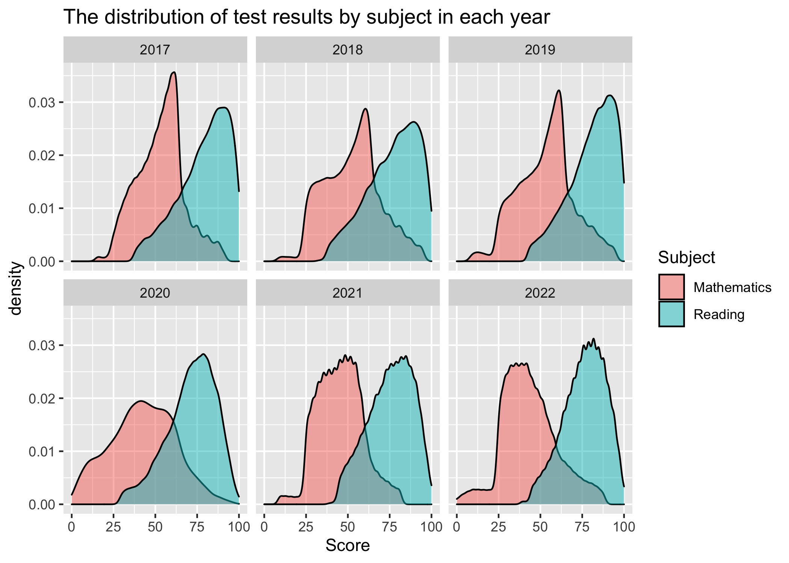
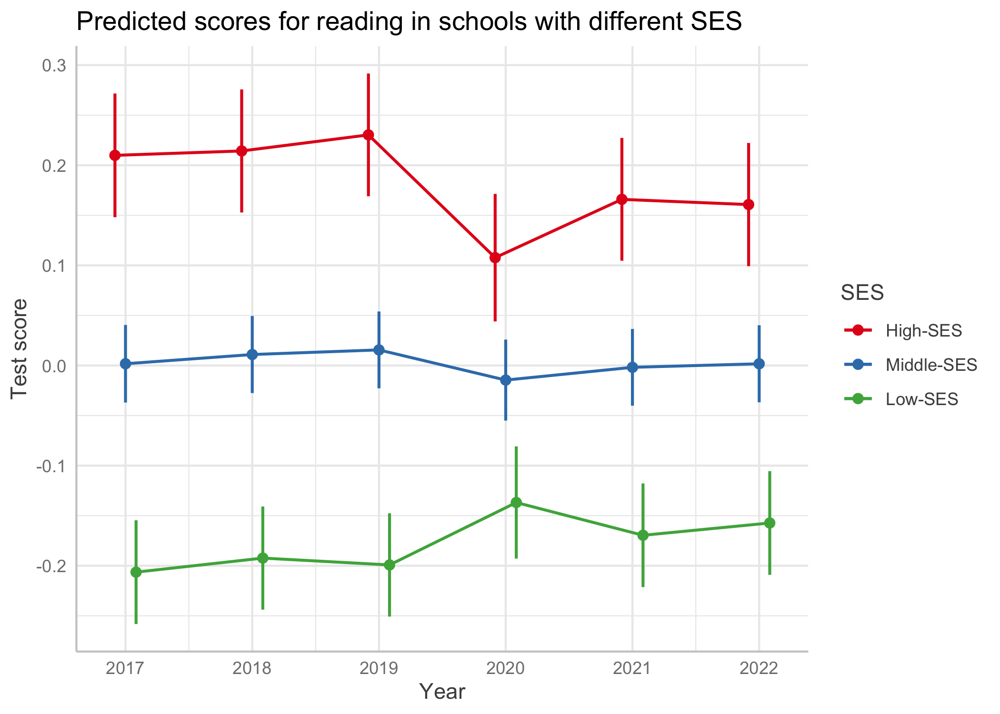

How Did the COVID-19 Pandemic Change Exam Results in the Region?
================================================================

Please note that the hidden sections contain detailed information about data cleaning and database creation. You may explore these sections if you are really extremely interested in technical details.

Key Results
-----------

-   The data reveals an unexpected pattern where exam results during the pandemic show an increase among schools with low socioeconomic status, while scores decline among schools with high socioeconomic status. As a result, the disparity between schools is reduced due to the pandemic.
-   On the entire sample of schools, the pandemic's influence on exam results in the region is relatively small, with only a weak average impact observed.

Preparing individual exam results for the analysis
--------------------------------------------------

 
Open this section

The data type is numeric, and there are no typos or unnecessary characters in the database. There are missing data points for some subjects, but it is not a problem due to the number of observations in the database. There are no duplicate records for students in the data.

    ## tibble [148,423 × 5] (S3: tbl_df/tbl/data.frame)
    ##  $ year   : num [1:148423] 2022 2022 2022 2022 2022 ...
    ##  $ schl_id: num [1:148423] 910001 910001 910001 910001 910002 ...
    ##  $ stud_id: num [1:148423] 2201460 2220542 2213537 2226928 2225580 ...
    ##  $ rus    : num [1:148423] 25 23 20 29 26 4 22 16 23 23 ...
    ##  $ math   : num [1:148423] 10 10 10 13 12 7 8 11 8 9 ...

    ##    year schl_id stud_id     rus    math 
    ##       0       0       0    2648    1852

    ##    year schl_id stud_id     rus    math 
    ##  148417  147455       0  148382  148389

To compare exam scores across different years, we will transform the scores by converting them into a percentage of completion. This involves dividing all score values by the maximum possible score for the exam in each specific year. This step is necessary as the maximum scores vary from year to year.

    ##   year rus math
    ## 1 2017  39   32
    ## 2 2018  39   32
    ## 3 2019  39   32
    ## 4 2020  33   32
    ## 5 2021  33   31
    ## 6 2022  33   31

Let's now examine the descriptive statistics. We observe that certain exams have a zero percent completion rate, which is suspicious and may indicate the presence of outliers in the data. This is particularly concerning for the reading exam, where achievements are typically quite high.

<table class="table" style="width: auto !important; margin-left: auto; margin-right: auto;">
<thead>
<tr>
<th style="border-bottom:hidden;padding-bottom:0; padding-left:3px;padding-right:3px;text-align: center; " colspan="7">
The descriptive statistics for the results of the Unified State Exam  in the region from 2017 to 2022

</th>
</tr>
<tr>
<th style="text-align:left;">
Year
</th>
<th style="text-align:left;">
Subject
</th>
<th style="text-align:center;">
N
</th>
<th style="text-align:center;">
Mean
</th>
<th style="text-align:center;">
Std.d.
</th>
<th style="text-align:center;">
Min
</th>
<th style="text-align:left;">
Max
</th>
</tr>
</thead>
<tbody>
<tr grouplength="6">
<td colspan="7" style="border-bottom: 1px solid;">
<strong>Reading</strong>
</td>
</tr>
<tr>
<td style="text-align:left;padding-left: 2em;" indentlevel="1">
2017
</td>
<td style="text-align:left;">
rus
</td>
<td style="text-align:center;">
23541
</td>
<td style="text-align:center;">
79
</td>
<td style="text-align:center;">
15
</td>
<td style="text-align:center;">
0
</td>
<td style="text-align:left;">
100
</td>
</tr>
<tr>
<td style="text-align:left;padding-left: 2em;" indentlevel="1">
2018
</td>
<td style="text-align:left;">
rus
</td>
<td style="text-align:center;">
25723
</td>
<td style="text-align:center;">
77
</td>
<td style="text-align:center;">
15
</td>
<td style="text-align:center;">
0
</td>
<td style="text-align:left;">
100
</td>
</tr>
<tr>
<td style="text-align:left;padding-left: 2em;" indentlevel="1">
2019
</td>
<td style="text-align:left;">
rus
</td>
<td style="text-align:center;">
27349
</td>
<td style="text-align:center;">
80
</td>
<td style="text-align:center;">
15
</td>
<td style="text-align:center;">
0
</td>
<td style="text-align:left;">
100
</td>
</tr>
<tr>
<td style="text-align:left;padding-left: 2em;" indentlevel="1">
2020
</td>
<td style="text-align:left;">
rus
</td>
<td style="text-align:center;">
14416
</td>
<td style="text-align:center;">
70
</td>
<td style="text-align:center;">
16
</td>
<td style="text-align:center;">
0
</td>
<td style="text-align:left;">
100
</td>
</tr>
<tr>
<td style="text-align:left;padding-left: 2em;" indentlevel="1">
2021
</td>
<td style="text-align:left;">
rus
</td>
<td style="text-align:center;">
27485
</td>
<td style="text-align:center;">
75
</td>
<td style="text-align:center;">
14
</td>
<td style="text-align:center;">
0
</td>
<td style="text-align:left;">
100
</td>
</tr>
<tr>
<td style="text-align:left;padding-left: 2em;" indentlevel="1">
2022
</td>
<td style="text-align:left;">
rus
</td>
<td style="text-align:center;">
27261
</td>
<td style="text-align:center;">
76
</td>
<td style="text-align:center;">
14
</td>
<td style="text-align:center;">
0
</td>
<td style="text-align:left;">
100
</td>
</tr>
<tr grouplength="6">
<td colspan="7" style="border-bottom: 1px solid;">
<strong>Math</strong>
</td>
</tr>
<tr>
<td style="text-align:left;padding-left: 2em;" indentlevel="1">
2017
</td>
<td style="text-align:left;">
math
</td>
<td style="text-align:center;">
23549
</td>
<td style="text-align:center;">
54
</td>
<td style="text-align:center;">
15
</td>
<td style="text-align:center;">
0
</td>
<td style="text-align:left;">
100
</td>
</tr>
<tr>
<td style="text-align:left;padding-left: 2em;" indentlevel="1">
2018
</td>
<td style="text-align:left;">
math
</td>
<td style="text-align:center;">
25959
</td>
<td style="text-align:center;">
53
</td>
<td style="text-align:center;">
18
</td>
<td style="text-align:center;">
0
</td>
<td style="text-align:left;">
100
</td>
</tr>
<tr>
<td style="text-align:left;padding-left: 2em;" indentlevel="1">
2019
</td>
<td style="text-align:left;">
math
</td>
<td style="text-align:center;">
27637
</td>
<td style="text-align:center;">
54
</td>
<td style="text-align:center;">
18
</td>
<td style="text-align:center;">
0
</td>
<td style="text-align:left;">
100
</td>
</tr>
<tr>
<td style="text-align:left;padding-left: 2em;" indentlevel="1">
2020
</td>
<td style="text-align:left;">
math
</td>
<td style="text-align:center;">
14054
</td>
<td style="text-align:center;">
42
</td>
<td style="text-align:center;">
19
</td>
<td style="text-align:center;">
0
</td>
<td style="text-align:left;">
100
</td>
</tr>
<tr>
<td style="text-align:left;padding-left: 2em;" indentlevel="1">
2021
</td>
<td style="text-align:left;">
math
</td>
<td style="text-align:center;">
27476
</td>
<td style="text-align:center;">
46
</td>
<td style="text-align:center;">
15
</td>
<td style="text-align:center;">
0
</td>
<td style="text-align:left;">
100
</td>
</tr>
<tr>
<td style="text-align:left;padding-left: 2em;" indentlevel="1">
2022
</td>
<td style="text-align:left;">
math
</td>
<td style="text-align:center;">
27896
</td>
<td style="text-align:center;">
44
</td>
<td style="text-align:center;">
17
</td>
<td style="text-align:center;">
0
</td>
<td style="text-align:left;">
100
</td>
</tr>
</tbody>
</table>
We should also examine box plot graphs as they can reveal any outliers or suspicious values in the data. Upon inspection, we indeed observe the existence of such values. In the reading subject, despite the presence of high average scores, we notice a number of unusually low values for the exam completion percentage. Similarly, in mathematics, we encounter both exceptionally low and high scores.

To remove outliers from the dataset, we utilize the formal Tukey's method to determine the number of outliers for each subject in each year.

    ## # A tibble: 2 × 3
    ##   subject      n outliers
    ##   <chr>    <int>    <int>
    ## 1 math    146571     2747
    ## 2 rus     145775     1418

Overall, we can see that there aren't many of them, considering the total number of observations for each year and subject, so we can remove these data from the database.

    ##    year schl_id stud_id subject   score 
    ##       0       0       0       0    4500

    ##    year schl_id stud_id subject   score 
    ##       0       0       0       0    8665

Descriptive analysis of individual exam results
-----------------------------------------------

 
Open this section

Next, we will conduct an initial exploratory data analysis using the percentage of exam completion (ranging from 0 to 100) as an indicator of subject achievement, based on the dataset without outliers. We will examine the descriptive statistics by year and subject. The analysis reveals a decrease in average scores for reading and mathematics after 2019.

<table class="table" style="width: auto !important; margin-left: auto; margin-right: auto;">
<thead>
<tr>
<th style="border-bottom:hidden;padding-bottom:0; padding-left:3px;padding-right:3px;text-align: center; " colspan="7">
Descriptive Statistics of Unified State Exam   Results in 2017-2022

</th>
</tr>
<tr>
<th style="text-align:left;">
Year
</th>
<th style="text-align:center;">
Subject
</th>
<th style="text-align:center;">
N
</th>
<th style="text-align:center;">
Mean
</th>
<th style="text-align:center;">
Std. dev.
</th>
<th style="text-align:center;">
Min
</th>
<th style="text-align:left;">
Max
</th>
</tr>
</thead>
<tbody>
<tr grouplength="6">
<td colspan="7" style="border-bottom: 1px solid;">
<strong>Reading</strong>
</td>
</tr>
<tr>
<td style="text-align:left;padding-left: 2em;" indentlevel="1">
2017
</td>
<td style="text-align:center;">
rus
</td>
<td style="text-align:center;">
23453
</td>
<td style="text-align:center;">
79
</td>
<td style="text-align:center;">
15
</td>
<td style="text-align:center;">
38
</td>
<td style="text-align:left;">
100
</td>
</tr>
<tr>
<td style="text-align:left;padding-left: 2em;" indentlevel="1">
2018
</td>
<td style="text-align:center;">
rus
</td>
<td style="text-align:center;">
25652
</td>
<td style="text-align:center;">
77
</td>
<td style="text-align:center;">
15
</td>
<td style="text-align:center;">
33
</td>
<td style="text-align:left;">
100
</td>
</tr>
<tr>
<td style="text-align:left;padding-left: 2em;" indentlevel="1">
2019
</td>
<td style="text-align:center;">
rus
</td>
<td style="text-align:center;">
26853
</td>
<td style="text-align:center;">
81
</td>
<td style="text-align:center;">
14
</td>
<td style="text-align:center;">
44
</td>
<td style="text-align:left;">
100
</td>
</tr>
<tr>
<td style="text-align:left;padding-left: 2em;" indentlevel="1">
2020
</td>
<td style="text-align:center;">
rus
</td>
<td style="text-align:center;">
14122
</td>
<td style="text-align:center;">
71
</td>
<td style="text-align:center;">
14
</td>
<td style="text-align:center;">
30
</td>
<td style="text-align:left;">
100
</td>
</tr>
<tr>
<td style="text-align:left;padding-left: 2em;" indentlevel="1">
2021
</td>
<td style="text-align:center;">
rus
</td>
<td style="text-align:center;">
27317
</td>
<td style="text-align:center;">
75
</td>
<td style="text-align:center;">
13
</td>
<td style="text-align:center;">
39
</td>
<td style="text-align:left;">
100
</td>
</tr>
<tr>
<td style="text-align:left;padding-left: 2em;" indentlevel="1">
2022
</td>
<td style="text-align:center;">
rus
</td>
<td style="text-align:center;">
26960
</td>
<td style="text-align:center;">
76
</td>
<td style="text-align:center;">
12
</td>
<td style="text-align:center;">
39
</td>
<td style="text-align:left;">
100
</td>
</tr>
<tr grouplength="6">
<td colspan="7" style="border-bottom: 1px solid;">
<strong>Mathematics</strong>
</td>
</tr>
<tr>
<td style="text-align:left;padding-left: 2em;" indentlevel="1">
2017
</td>
<td style="text-align:center;">
math
</td>
<td style="text-align:center;">
23000
</td>
<td style="text-align:center;">
53
</td>
<td style="text-align:center;">
14
</td>
<td style="text-align:center;">
16
</td>
<td style="text-align:left;">
91
</td>
</tr>
<tr>
<td style="text-align:left;padding-left: 2em;" indentlevel="1">
2018
</td>
<td style="text-align:center;">
math
</td>
<td style="text-align:center;">
25487
</td>
<td style="text-align:center;">
53
</td>
<td style="text-align:center;">
17
</td>
<td style="text-align:center;">
9
</td>
<td style="text-align:left;">
94
</td>
</tr>
<tr>
<td style="text-align:left;padding-left: 2em;" indentlevel="1">
2019
</td>
<td style="text-align:center;">
math
</td>
<td style="text-align:center;">
27062
</td>
<td style="text-align:center;">
53
</td>
<td style="text-align:center;">
17
</td>
<td style="text-align:center;">
9
</td>
<td style="text-align:left;">
94
</td>
</tr>
<tr>
<td style="text-align:left;padding-left: 2em;" indentlevel="1">
2020
</td>
<td style="text-align:center;">
math
</td>
<td style="text-align:center;">
14037
</td>
<td style="text-align:center;">
42
</td>
<td style="text-align:center;">
19
</td>
<td style="text-align:center;">
0
</td>
<td style="text-align:left;">
97
</td>
</tr>
<tr>
<td style="text-align:left;padding-left: 2em;" indentlevel="1">
2021
</td>
<td style="text-align:center;">
math
</td>
<td style="text-align:center;">
26630
</td>
<td style="text-align:center;">
45
</td>
<td style="text-align:center;">
13
</td>
<td style="text-align:center;">
10
</td>
<td style="text-align:left;">
81
</td>
</tr>
<tr>
<td style="text-align:left;padding-left: 2em;" indentlevel="1">
2022
</td>
<td style="text-align:center;">
math
</td>
<td style="text-align:center;">
27608
</td>
<td style="text-align:center;">
44
</td>
<td style="text-align:center;">
16
</td>
<td style="text-align:center;">
0
</td>
<td style="text-align:left;">
87
</td>
</tr>
</tbody>
</table>
Next, let's analyze a graph that illustrates the distribution of scores in reading and mathematics across a 6-year period.

-   The reading test consistently demonstrates the highest scores regardless of the exam year. This suggests that it is the easiest exam, with a distribution that is heavily skewed to the left. In other words, a significant portion of students tend to score above the average in reading.
-   In mathematics, the average percentage of exam completion is generally lower than in reading. The distribution is slightly skewed to the right in the last years. These findings indicate that the mathematics exam is relatively more challenging compared to the reading exam.

 For each subject separately, we observe a slight decline in the results in 2020. However, in reading, there seem to be a recovery in the results after 2020, while such a trend is absent in mathematics. It is worth noting nevertheless that these data do not yet provide evidence of a statistically significant effect of the pandemic and only visually illustrate the situation without any control variables.

 

Preparing school data for the analysis
--------------------------------------

 
Open this section

In this section we will load the school database from the file and work with it. The data in the file are in numeric format and have been accurately entered without any typos or extraneous symbols. The database contains 17 contextual variables for schools. We need to select a subset of variables that are conceptually meaningful, consistently measured across years, and have relatively few missing values. To begin this process, we will examine the number of missing values in the database for these variables and exclude those with a high number of missing values.

    ## tibble [4,855 × 19] (S3: tbl_df/tbl/data.frame)
    ##  $ year   : num [1:4855] 2021 2021 2021 2021 2021 ...
    ##  $ schl_id: num [1:4855] 910001 910002 910003 910004 910005 ...
    ##  $ ses1   : num [1:4855] 6.45 0.72 1.39 1.6 8.93 10 0 3.59 5.45 0 ...
    ##  $ ses2   : num [1:4855] 0 0 1.39 0.4 5.36 0 0 0 0 0 ...
    ##  $ ses3   : num [1:4855] 0 0 0.77 0 0 0 0 0 0 0 ...
    ##  $ ses4   : num [1:4855] 1.61 0.72 1.85 2.4 5.36 0 0 1.8 1.82 0 ...
    ##  $ ses5   : num [1:4855] 59.5 48 27.6 82.6 65.7 ...
    ##  $ ses6   : num [1:4855] 3.23 2.16 3.25 3.61 3.57 0 0 8.38 1.82 0 ...
    ##  $ ses7   : num [1:4855] 25.81 21.58 5.26 11.62 53.57 ...
    ##  $ ses8   : num [1:4855] NA NA NA NA NA NA NA NA NA NA ...
    ##  $ ses9   : num [1:4855] 4.84 12.95 40.65 9.62 5.36 ...
    ##  $ ses10  : num [1:4855] 24.2 25.2 32.6 20.4 37.5 ...
    ##  $ ses11  : num [1:4855] 59.7 41 11.1 30.5 42.9 ...
    ##  $ ses12  : num [1:4855] 4.84 4.32 1.24 3.01 16.07 ...
    ##  $ ses13  : num [1:4855] 1.61 10.79 1.55 4.61 12.5 ...
    ##  $ ses14  : num [1:4855] 6.45 5.04 1.08 0 3.57 0 0 0 0 0 ...
    ##  $ ses15  : num [1:4855] 85.48 5.76 15.92 12.42 14.29 ...
    ##  $ ses16  : num [1:4855] 32 33 0 0 65 110 65 22 90 120 ...
    ##  $ ses17  : num [1:4855] 82 80 50 58 105 150 100 74 140 170 ...

    ##       year         schl_id            ses1             ses2        
    ##  Min.   :2017   Min.   :832002   Min.   :  0.00   Min.   :  0.000  
    ##  1st Qu.:2018   1st Qu.:919207   1st Qu.:  0.00   1st Qu.:  0.000  
    ##  Median :2019   Median :930010   Median :  1.07   Median :  0.000  
    ##  Mean   :2019   Mean   :941988   Mean   :  2.32   Mean   :  2.928  
    ##  3rd Qu.:2020   3rd Qu.:945006   3rd Qu.:  2.86   3rd Qu.:  0.450  
    ##  Max.   :2021   Max.   :999212   Max.   :100.00   Max.   :100.000  
    ##                                  NA's   :46       NA's   :2931     
    ##       ses3             ses4              ses5             ses6       
    ##  Min.   :  0.00   Min.   :  0.000   Min.   :  0.00   Min.   : 0.000  
    ##  1st Qu.:  0.00   1st Qu.:  2.380   1st Qu.: 18.48   1st Qu.: 0.000  
    ##  Median :  0.00   Median :  5.190   Median : 45.13   Median : 1.540  
    ##  Mean   :  1.09   Mean   :  9.452   Mean   : 47.76   Mean   : 3.406  
    ##  3rd Qu.:  0.00   3rd Qu.: 10.420   3rd Qu.: 75.00   3rd Qu.: 4.055  
    ##  Max.   :100.00   Max.   :100.000   Max.   :100.00   Max.   :82.500  
    ##  NA's   :40       NA's   :45        NA's   :2957     NA's   :48      
    ##       ses7              ses8             ses9            ses10       
    ##  Min.   :  0.000   Min.   :  0.00   Min.   :  0.00   Min.   :  0.00  
    ##  1st Qu.:  1.895   1st Qu.: 39.55   1st Qu.:  9.43   1st Qu.: 15.91  
    ##  Median : 11.360   Median : 74.33   Median : 18.39   Median : 21.45  
    ##  Mean   : 17.227   Mean   : 64.27   Mean   : 27.66   Mean   : 23.23  
    ##  3rd Qu.: 26.670   3rd Qu.: 91.10   3rd Qu.: 40.78   3rd Qu.: 28.86  
    ##  Max.   :100.000   Max.   :100.00   Max.   :100.00   Max.   :100.00  
    ##  NA's   :49        NA's   :963      NA's   :3906     NA's   :49      
    ##      ses11           ses12             ses13            ses14       
    ##  Min.   : 0.00   Min.   :  0.000   Min.   :  0.00   Min.   : 0.000  
    ##  1st Qu.:14.94   1st Qu.:  0.000   1st Qu.:  4.03   1st Qu.: 0.000  
    ##  Median :25.87   Median :  0.250   Median : 17.07   Median : 0.360  
    ##  Mean   :28.19   Mean   :  2.539   Mean   : 25.19   Mean   : 1.564  
    ##  3rd Qu.:38.46   3rd Qu.:  2.750   3rd Qu.: 37.08   3rd Qu.: 1.670  
    ##  Max.   :90.91   Max.   :100.000   Max.   :100.00   Max.   :76.720  
    ##  NA's   :48      NA's   :49        NA's   :49       NA's   :3906    
    ##      ses15            ses16            ses17      
    ##  Min.   :  0.00   Min.   :  0.00   Min.   :  0.0  
    ##  1st Qu.:  0.00   1st Qu.:  0.00   1st Qu.: 14.0  
    ##  Median : 14.55   Median : 16.00   Median :125.0  
    ##  Mean   : 31.85   Mean   : 21.27   Mean   :203.6  
    ##  3rd Qu.: 61.02   3rd Qu.: 35.75   3rd Qu.:380.0  
    ##  Max.   :100.00   Max.   :120.00   Max.   :723.0  
    ##  NA's   :3906     NA's   :3905     NA's   :3905

    ## # A tibble: 5 × 19
    ##    year     n ses1_miss ses2_miss ses3_miss ses4_miss ses5_miss ses6_miss
    ##   <dbl> <int>     <int>     <int>     <int>     <int>     <int>     <int>
    ## 1  2017   967        16       967        14        16       967        17
    ## 2  2018   985        14       985        13        13       985        14
    ## 3  2019   972         8       972         6         8       972         9
    ## 4  2020   973         1         1         1         1        14         1
    ## 5  2021   958         7         6         6         7        19         7
    ## # … with 11 more variables: ses7_miss <int>, ses8_miss <int>, ses9_miss <int>,
    ## #   ses10_miss <int>, ses11_miss <int>, ses12_miss <int>, ses13_miss <int>,
    ## #   ses14_miss <int>, ses15_miss <int>, ses16_miss <int>, ses17_miss <int>

After considering the relatively large number of missing values for several contextual variables, which were eventually removed, the following data remains in the database:

-   ses1: Proportion of students on the school register
-   ses3: Proportion of students learning Russian language for less than one year
-   ses4: Proportion of students with special needs (disabled children)
-   ses7: Proportion of students with one/both parents unemployed
-   ses8: Proportion of students with both parents without higher education
-   ses10: Proportion of students from incomplete families
-   ses11: Proportion of students from large families
-   ses12: Proportion of students from socially vulnerable families/leading a deviant lifestyle
-   ses13: Proportion of students from low-income families

For now we will keep all this variables and create averages for schools from 2017 to 2021 (contextual variables are available only until the year 2021). These new variables will provide an overview of the average socio-economic characteristics of the student population throughout the study period.

Based on this data, we will identify schools with outliers in the means and variances of context variables, which suggest extreme values and significant changes in their student population over the past 5 years compared to the overall sample. These schools probably had errors in the data collection process, and we will exclude them from the analysis.

    ## schl_id  ses1_m  ses1_v  ses3_m  ses3_v  ses4_m  ses4_v  ses7_m  ses7_v  ses8_m 
    ##       0       6      14       6      14       6      14       6      14       7 
    ##  ses8_v ses10_m ses10_v ses11_m ses11_v ses12_m ses12_v ses13_m ses13_v 
    ##      19       6      14       6      14       6      14       6      14

    ## schl_id  ses1_m  ses1_v  ses3_m  ses3_v  ses4_m  ses4_v  ses7_m  ses7_v  ses8_m 
    ##       0     161     146     244     244     180     142     128     120     122 
    ##  ses8_v ses10_m ses10_v ses11_m ses11_v ses12_m ses12_v ses13_m ses13_v 
    ##     122     126     106     119     117     200     179     158     140

Descriptive analysis of school context variables
------------------------------------------------

 
Open this section

Here are the conclusions that can be drawn from the descriptive statistics table:

-   Even after removing data from several schools, there is still sufficient information in the database.
-   Schools in the region differ significantly in terms of the proportion of students from families where both parents do not have higher education (on average 65%) and the proportion of students from low-income families (20%).
-   There are smaller differences between schools in terms of the proportion of students with disabilities (5,4%), from unemployed families (14%), from incomplete families (22%), from large families (26%) and low-incone families (20%).
-   The weakest indicators with low variance and close to zero mean values, are students on internal school records (1,5%), students studying Russian language for less than a year (0%), and students from socially vulnerable families (1%). There are very few of them in the region's schools. We will exclude this variables from the database.

<table class="table" style="margin-left: auto; margin-right: auto;">
<caption>
Descriptive Statistics of Average School Data in 2017-2021
</caption>
<thead>
<tr>
<th style="text-align:left;">
Variable
</th>
<th style="text-align:left;">
NotNA
</th>
<th style="text-align:left;">
Mean
</th>
<th style="text-align:left;">
Sd
</th>
<th style="text-align:left;">
Min
</th>
<th style="text-align:left;">
Max
</th>
</tr>
</thead>
<tbody>
<tr>
<td style="text-align:left;">
ses1: Proportion of students on the school register
</td>
<td style="text-align:left;">
839
</td>
<td style="text-align:left;">
1.5
</td>
<td style="text-align:left;">
1.4
</td>
<td style="text-align:left;">
0
</td>
<td style="text-align:left;">
6.3
</td>
</tr>
<tr>
<td style="text-align:left;">
ses3: Proportion of students learning Russian language for less than one year
</td>
<td style="text-align:left;">
756
</td>
<td style="text-align:left;">
0
</td>
<td style="text-align:left;">
0
</td>
<td style="text-align:left;">
0
</td>
<td style="text-align:left;">
0
</td>
</tr>
<tr>
<td style="text-align:left;">
ses4: Proportion of students with special needs (disabled children)
</td>
<td style="text-align:left;">
820
</td>
<td style="text-align:left;">
5.4
</td>
<td style="text-align:left;">
4.3
</td>
<td style="text-align:left;">
0
</td>
<td style="text-align:left;">
21
</td>
</tr>
<tr>
<td style="text-align:left;">
ses7: Proportion of students with one/both parents unemployed
</td>
<td style="text-align:left;">
872
</td>
<td style="text-align:left;">
14
</td>
<td style="text-align:left;">
14
</td>
<td style="text-align:left;">
0
</td>
<td style="text-align:left;">
60
</td>
</tr>
<tr>
<td style="text-align:left;">
ses8: Proportion of students with both parents without higher education
</td>
<td style="text-align:left;">
878
</td>
<td style="text-align:left;">
65
</td>
<td style="text-align:left;">
31
</td>
<td style="text-align:left;">
0
</td>
<td style="text-align:left;">
100
</td>
</tr>
<tr>
<td style="text-align:left;">
ses10: Proportion of students from incomplete families
</td>
<td style="text-align:left;">
874
</td>
<td style="text-align:left;">
22
</td>
<td style="text-align:left;">
8.3
</td>
<td style="text-align:left;">
0
</td>
<td style="text-align:left;">
45
</td>
</tr>
<tr>
<td style="text-align:left;">
ses11: Proportion of students from large families
</td>
<td style="text-align:left;">
881
</td>
<td style="text-align:left;">
26
</td>
<td style="text-align:left;">
14
</td>
<td style="text-align:left;">
0
</td>
<td style="text-align:left;">
72
</td>
</tr>
<tr>
<td style="text-align:left;">
ses12: Proportion of students from socially vulnerable families/leading a deviant lifestyle
</td>
<td style="text-align:left;">
800
</td>
<td style="text-align:left;">
1
</td>
<td style="text-align:left;">
1.5
</td>
<td style="text-align:left;">
0
</td>
<td style="text-align:left;">
7.6
</td>
</tr>
<tr>
<td style="text-align:left;">
ses13: Proportion of students from low-income families
</td>
<td style="text-align:left;">
842
</td>
<td style="text-align:left;">
20
</td>
<td style="text-align:left;">
20
</td>
<td style="text-align:left;">
0
</td>
<td style="text-align:left;">
88
</td>
</tr>
</tbody>
</table>

Preparing final database for the analysis
-----------------------------------------

 
Open this section

Now we can merge the individual student data with the school-level context characteristics. Let's examine how the remaining school-level context characteristics in the database are associated with the exam results of the students.

 Based on the plot, the strongest correlation (and it's negative) with exam results shows the proportion of students from families where both parents do not have a higher education. Besides, this variable is strongly correlated with other student population characteristics. According to theory and our previous research findings, this specific variable is the most meaningful and substantively relevant. Therefore, in the future models, we will include only this one variable as a control characteristic of school context.

The impact of the COVID-19 pandemic on exam results
---------------------------------------------------

To answer the main research question - how the COVID-19 pandemic has affected the quality of the Unified State Exam (USE) results in the region - I will employ multilevel regression modeling. The models will account for a three-level structure of the data, with students at the first level, the year of examination at the second level, and schools at the third level. At the school level, one contextual characteristic will be controlled as a proxy for socioeconomic status (SES): the proportion of children from families where both parents lack higher education averaged for the period from 2017 to 2021.

For each subject, two regression models will be constructed. The first model will estimate the differences in results between the years of study for the entire sample, without assuming a differential effect of the pandemic. In the second model, the interaction variable will be included, and the differences in results between the years will be estimated for schools with different levels of contextual variable. The random intercept and fixed slope model is used, demonstrating the best fit to the data.

In the models below, exam results for different years are compared to the reference year of 2020, when students were required to learn remotely for part of the academic year. The data obtained reveals interesting patterns. When considering the overall sample without the interaction variable, the exam results for all years are nearly identical. Although there is a statistically significant increase in math scores after the pandemic, the effect size is so small that it is difficult to argue for a real improvement compared to previous years. In other words, on average, the exam results in the region did not change due to the COVID-19 pandemic.

<table style="border-collapse:collapse; border:none;">
<tr>
<th style="border-top: double; text-align:center; font-style:normal; font-weight:bold; padding:0.2cm;  text-align:left; ">
 
</th>
<th colspan="3" style="border-top: double; text-align:center; font-style:normal; font-weight:bold; padding:0.2cm; ">
Reading
</th>
<th colspan="3" style="border-top: double; text-align:center; font-style:normal; font-weight:bold; padding:0.2cm; ">
Reading (with interaction)
</th>
</tr>
<tr>
<td style=" text-align:center; border-bottom:1px solid; font-style:italic; font-weight:normal;  text-align:left; ">
Predictors
</td>
<td style=" text-align:center; border-bottom:1px solid; font-style:italic; font-weight:normal;  ">
Estimates
</td>
<td style=" text-align:center; border-bottom:1px solid; font-style:italic; font-weight:normal;  ">
CI
</td>
<td style=" text-align:center; border-bottom:1px solid; font-style:italic; font-weight:normal;  ">
p
</td>
<td style=" text-align:center; border-bottom:1px solid; font-style:italic; font-weight:normal;  ">
Estimates
</td>
<td style=" text-align:center; border-bottom:1px solid; font-style:italic; font-weight:normal;  ">
CI
</td>
<td style=" text-align:center; border-bottom:1px solid; font-style:italic; font-weight:normal;  col7">
p
</td>
<td style=" text-align:center; border-bottom:1px solid; font-style:italic; font-weight:normal;  col8">
Estimates
</td>
<td style=" text-align:center; border-bottom:1px solid; font-style:italic; font-weight:normal;  col9">
CI
</td>
<td style=" text-align:center; border-bottom:1px solid; font-style:italic; font-weight:normal;  0">
p
</td>
<td style=" text-align:center; border-bottom:1px solid; font-style:italic; font-weight:normal;  1">
Estimates
</td>
<td style=" text-align:center; border-bottom:1px solid; font-style:italic; font-weight:normal;  2">
CI
</td>
<td style=" text-align:center; border-bottom:1px solid; font-style:italic; font-weight:normal;  3">
p
</td>
</tr>
<tr>
<td style=" padding:0.2cm; text-align:left; vertical-align:top; text-align:left; ">
(Intercept)
</td>
<td style=" padding:0.2cm; text-align:left; vertical-align:top; text-align:center;  ">
-0.24
</td>
<td style=" padding:0.2cm; text-align:left; vertical-align:top; text-align:center;  ">
-0.27 – -0.21
</td>
<td style=" padding:0.2cm; text-align:left; vertical-align:top; text-align:center;  ">
<strong>&lt;0.001</strong>
</td>
<td style=" padding:0.2cm; text-align:left; vertical-align:top; text-align:center;  ">
-0.18
</td>
<td style=" padding:0.2cm; text-align:left; vertical-align:top; text-align:center;  ">
-0.21 – -0.14
</td>
<td style=" padding:0.2cm; text-align:left; vertical-align:top; text-align:center;  col7">
<strong>&lt;0.001</strong>
</td>
<td style=" padding:0.2cm; text-align:left; vertical-align:top; text-align:center;  col8">
-0.26
</td>
<td style=" padding:0.2cm; text-align:left; vertical-align:top; text-align:center;  col9">
-0.29 – -0.22
</td>
<td style=" padding:0.2cm; text-align:left; vertical-align:top; text-align:center;  0">
<strong>&lt;0.001</strong>
</td>
<td style=" padding:0.2cm; text-align:left; vertical-align:top; text-align:center;  1">
-0.22
</td>
<td style=" padding:0.2cm; text-align:left; vertical-align:top; text-align:center;  2">
-0.26 – -0.18
</td>
<td style=" padding:0.2cm; text-align:left; vertical-align:top; text-align:center;  3">
<strong>&lt;0.001</strong>
</td>
</tr>
<tr>
<td style=" padding:0.2cm; text-align:left; vertical-align:top; text-align:left; ">
year f \[2017\]
</td>
<td style=" padding:0.2cm; text-align:left; vertical-align:top; text-align:center;  ">
-0.01
</td>
<td style=" padding:0.2cm; text-align:left; vertical-align:top; text-align:center;  ">
-0.04 – 0.02
</td>
<td style=" padding:0.2cm; text-align:left; vertical-align:top; text-align:center;  ">
0.414
</td>
<td style=" padding:0.2cm; text-align:left; vertical-align:top; text-align:center;  ">
-0.09
</td>
<td style=" padding:0.2cm; text-align:left; vertical-align:top; text-align:center;  ">
-0.13 – -0.05
</td>
<td style=" padding:0.2cm; text-align:left; vertical-align:top; text-align:center;  col7">
<strong>&lt;0.001</strong>
</td>
<td style=" padding:0.2cm; text-align:left; vertical-align:top; text-align:center;  col8">
-0.02
</td>
<td style=" padding:0.2cm; text-align:left; vertical-align:top; text-align:center;  col9">
-0.05 – 0.02
</td>
<td style=" padding:0.2cm; text-align:left; vertical-align:top; text-align:center;  0">
0.274
</td>
<td style=" padding:0.2cm; text-align:left; vertical-align:top; text-align:center;  1">
-0.07
</td>
<td style=" padding:0.2cm; text-align:left; vertical-align:top; text-align:center;  2">
-0.11 – -0.03
</td>
<td style=" padding:0.2cm; text-align:left; vertical-align:top; text-align:center;  3">
<strong>0.001</strong>
</td>
</tr>
<tr>
<td style=" padding:0.2cm; text-align:left; vertical-align:top; text-align:left; ">
year f \[2018\]
</td>
<td style=" padding:0.2cm; text-align:left; vertical-align:top; text-align:center;  ">
-0.00
</td>
<td style=" padding:0.2cm; text-align:left; vertical-align:top; text-align:center;  ">
-0.03 – 0.03
</td>
<td style=" padding:0.2cm; text-align:left; vertical-align:top; text-align:center;  ">
0.888
</td>
<td style=" padding:0.2cm; text-align:left; vertical-align:top; text-align:center;  ">
-0.08
</td>
<td style=" padding:0.2cm; text-align:left; vertical-align:top; text-align:center;  ">
-0.11 – -0.04
</td>
<td style=" padding:0.2cm; text-align:left; vertical-align:top; text-align:center;  col7">
<strong>&lt;0.001</strong>
</td>
<td style=" padding:0.2cm; text-align:left; vertical-align:top; text-align:center;  col8">
0.02
</td>
<td style=" padding:0.2cm; text-align:left; vertical-align:top; text-align:center;  col9">
-0.02 – 0.05
</td>
<td style=" padding:0.2cm; text-align:left; vertical-align:top; text-align:center;  0">
0.385
</td>
<td style=" padding:0.2cm; text-align:left; vertical-align:top; text-align:center;  1">
-0.02
</td>
<td style=" padding:0.2cm; text-align:left; vertical-align:top; text-align:center;  2">
-0.06 – 0.01
</td>
<td style=" padding:0.2cm; text-align:left; vertical-align:top; text-align:center;  3">
0.216
</td>
</tr>
<tr>
<td style=" padding:0.2cm; text-align:left; vertical-align:top; text-align:left; ">
year f \[2019\]
</td>
<td style=" padding:0.2cm; text-align:left; vertical-align:top; text-align:center;  ">
-0.01
</td>
<td style=" padding:0.2cm; text-align:left; vertical-align:top; text-align:center;  ">
-0.04 – 0.02
</td>
<td style=" padding:0.2cm; text-align:left; vertical-align:top; text-align:center;  ">
0.490
</td>
<td style=" padding:0.2cm; text-align:left; vertical-align:top; text-align:center;  ">
-0.10
</td>
<td style=" padding:0.2cm; text-align:left; vertical-align:top; text-align:center;  ">
-0.13 – -0.06
</td>
<td style=" padding:0.2cm; text-align:left; vertical-align:top; text-align:center;  col7">
<strong>&lt;0.001</strong>
</td>
<td style=" padding:0.2cm; text-align:left; vertical-align:top; text-align:center;  col8">
-0.00
</td>
<td style=" padding:0.2cm; text-align:left; vertical-align:top; text-align:center;  col9">
-0.04 – 0.03
</td>
<td style=" padding:0.2cm; text-align:left; vertical-align:top; text-align:center;  0">
0.927
</td>
<td style=" padding:0.2cm; text-align:left; vertical-align:top; text-align:center;  1">
-0.06
</td>
<td style=" padding:0.2cm; text-align:left; vertical-align:top; text-align:center;  2">
-0.10 – -0.02
</td>
<td style=" padding:0.2cm; text-align:left; vertical-align:top; text-align:center;  3">
<strong>0.004</strong>
</td>
</tr>
<tr>
<td style=" padding:0.2cm; text-align:left; vertical-align:top; text-align:left; ">
year f \[2021\]
</td>
<td style=" padding:0.2cm; text-align:left; vertical-align:top; text-align:center;  ">
0.01
</td>
<td style=" padding:0.2cm; text-align:left; vertical-align:top; text-align:center;  ">
-0.02 – 0.04
</td>
<td style=" padding:0.2cm; text-align:left; vertical-align:top; text-align:center;  ">
0.478
</td>
<td style=" padding:0.2cm; text-align:left; vertical-align:top; text-align:center;  ">
-0.04
</td>
<td style=" padding:0.2cm; text-align:left; vertical-align:top; text-align:center;  ">
-0.07 – 0.00
</td>
<td style=" padding:0.2cm; text-align:left; vertical-align:top; text-align:center;  col7">
0.061
</td>
<td style=" padding:0.2cm; text-align:left; vertical-align:top; text-align:center;  col8">
0.04
</td>
<td style=" padding:0.2cm; text-align:left; vertical-align:top; text-align:center;  col9">
0.00 – 0.07
</td>
<td style=" padding:0.2cm; text-align:left; vertical-align:top; text-align:center;  0">
<strong>0.026</strong>
</td>
<td style=" padding:0.2cm; text-align:left; vertical-align:top; text-align:center;  1">
0.02
</td>
<td style=" padding:0.2cm; text-align:left; vertical-align:top; text-align:center;  2">
-0.02 – 0.06
</td>
<td style=" padding:0.2cm; text-align:left; vertical-align:top; text-align:center;  3">
0.241
</td>
</tr>
<tr>
<td style=" padding:0.2cm; text-align:left; vertical-align:top; text-align:left; ">
year f \[2022\]
</td>
<td style=" padding:0.2cm; text-align:left; vertical-align:top; text-align:center;  ">
0.02
</td>
<td style=" padding:0.2cm; text-align:left; vertical-align:top; text-align:center;  ">
-0.01 – 0.05
</td>
<td style=" padding:0.2cm; text-align:left; vertical-align:top; text-align:center;  ">
0.259
</td>
<td style=" padding:0.2cm; text-align:left; vertical-align:top; text-align:center;  ">
-0.03
</td>
<td style=" padding:0.2cm; text-align:left; vertical-align:top; text-align:center;  ">
-0.06 – 0.01
</td>
<td style=" padding:0.2cm; text-align:left; vertical-align:top; text-align:center;  col7">
0.183
</td>
<td style=" padding:0.2cm; text-align:left; vertical-align:top; text-align:center;  col8">
0.05
</td>
<td style=" padding:0.2cm; text-align:left; vertical-align:top; text-align:center;  col9">
0.02 – 0.08
</td>
<td style=" padding:0.2cm; text-align:left; vertical-align:top; text-align:center;  0">
<strong>0.005</strong>
</td>
<td style=" padding:0.2cm; text-align:left; vertical-align:top; text-align:center;  1">
0.04
</td>
<td style=" padding:0.2cm; text-align:left; vertical-align:top; text-align:center;  2">
-0.00 – 0.08
</td>
<td style=" padding:0.2cm; text-align:left; vertical-align:top; text-align:center;  3">
0.054
</td>
</tr>
<tr>
<td style=" padding:0.2cm; text-align:left; vertical-align:top; text-align:left; ">
ses8 std
</td>
<td style=" padding:0.2cm; text-align:left; vertical-align:top; text-align:center;  ">
-0.23
</td>
<td style=" padding:0.2cm; text-align:left; vertical-align:top; text-align:center;  ">
-0.25 – -0.21
</td>
<td style=" padding:0.2cm; text-align:left; vertical-align:top; text-align:center;  ">
<strong>&lt;0.001</strong>
</td>
<td style=" padding:0.2cm; text-align:left; vertical-align:top; text-align:center;  ">
-0.14
</td>
<td style=" padding:0.2cm; text-align:left; vertical-align:top; text-align:center;  ">
-0.18 – -0.11
</td>
<td style=" padding:0.2cm; text-align:left; vertical-align:top; text-align:center;  col7">
<strong>&lt;0.001</strong>
</td>
<td style=" padding:0.2cm; text-align:left; vertical-align:top; text-align:center;  col8">
-0.25
</td>
<td style=" padding:0.2cm; text-align:left; vertical-align:top; text-align:center;  col9">
-0.27 – -0.23
</td>
<td style=" padding:0.2cm; text-align:left; vertical-align:top; text-align:center;  0">
<strong>&lt;0.001</strong>
</td>
<td style=" padding:0.2cm; text-align:left; vertical-align:top; text-align:center;  1">
-0.20
</td>
<td style=" padding:0.2cm; text-align:left; vertical-align:top; text-align:center;  2">
-0.23 – -0.16
</td>
<td style=" padding:0.2cm; text-align:left; vertical-align:top; text-align:center;  3">
<strong>&lt;0.001</strong>
</td>
</tr>
<tr>
<td style=" padding:0.2cm; text-align:left; vertical-align:top; text-align:left; ">
year f \[2017\] × ses8 std
</td>
<td style=" padding:0.2cm; text-align:left; vertical-align:top; text-align:center;  ">
</td>
<td style=" padding:0.2cm; text-align:left; vertical-align:top; text-align:center;  ">
</td>
<td style=" padding:0.2cm; text-align:left; vertical-align:top; text-align:center;  ">
</td>
<td style=" padding:0.2cm; text-align:left; vertical-align:top; text-align:center;  ">
-0.11
</td>
<td style=" padding:0.2cm; text-align:left; vertical-align:top; text-align:center;  ">
-0.14 – -0.08
</td>
<td style=" padding:0.2cm; text-align:left; vertical-align:top; text-align:center;  col7">
<strong>&lt;0.001</strong>
</td>
<td style=" padding:0.2cm; text-align:left; vertical-align:top; text-align:center;  col8">
</td>
<td style=" padding:0.2cm; text-align:left; vertical-align:top; text-align:center;  col9">
</td>
<td style=" padding:0.2cm; text-align:left; vertical-align:top; text-align:center;  0">
</td>
<td style=" padding:0.2cm; text-align:left; vertical-align:top; text-align:center;  1">
-0.10
</td>
<td style=" padding:0.2cm; text-align:left; vertical-align:top; text-align:center;  2">
-0.13 – -0.06
</td>
<td style=" padding:0.2cm; text-align:left; vertical-align:top; text-align:center;  3">
<strong>&lt;0.001</strong>
</td>
</tr>
<tr>
<td style=" padding:0.2cm; text-align:left; vertical-align:top; text-align:left; ">
year f \[2018\] × ses8 std
</td>
<td style=" padding:0.2cm; text-align:left; vertical-align:top; text-align:center;  ">
</td>
<td style=" padding:0.2cm; text-align:left; vertical-align:top; text-align:center;  ">
</td>
<td style=" padding:0.2cm; text-align:left; vertical-align:top; text-align:center;  ">
</td>
<td style=" padding:0.2cm; text-align:left; vertical-align:top; text-align:center;  ">
-0.11
</td>
<td style=" padding:0.2cm; text-align:left; vertical-align:top; text-align:center;  ">
-0.14 – -0.08
</td>
<td style=" padding:0.2cm; text-align:left; vertical-align:top; text-align:center;  col7">
<strong>&lt;0.001</strong>
</td>
<td style=" padding:0.2cm; text-align:left; vertical-align:top; text-align:center;  col8">
</td>
<td style=" padding:0.2cm; text-align:left; vertical-align:top; text-align:center;  col9">
</td>
<td style=" padding:0.2cm; text-align:left; vertical-align:top; text-align:center;  0">
</td>
<td style=" padding:0.2cm; text-align:left; vertical-align:top; text-align:center;  1">
-0.07
</td>
<td style=" padding:0.2cm; text-align:left; vertical-align:top; text-align:center;  2">
-0.10 – -0.03
</td>
<td style=" padding:0.2cm; text-align:left; vertical-align:top; text-align:center;  3">
<strong>&lt;0.001</strong>
</td>
</tr>
<tr>
<td style=" padding:0.2cm; text-align:left; vertical-align:top; text-align:left; ">
year f \[2019\] × ses8 std
</td>
<td style=" padding:0.2cm; text-align:left; vertical-align:top; text-align:center;  ">
</td>
<td style=" padding:0.2cm; text-align:left; vertical-align:top; text-align:center;  ">
</td>
<td style=" padding:0.2cm; text-align:left; vertical-align:top; text-align:center;  ">
</td>
<td style=" padding:0.2cm; text-align:left; vertical-align:top; text-align:center;  ">
-0.13
</td>
<td style=" padding:0.2cm; text-align:left; vertical-align:top; text-align:center;  ">
-0.16 – -0.10
</td>
<td style=" padding:0.2cm; text-align:left; vertical-align:top; text-align:center;  col7">
<strong>&lt;0.001</strong>
</td>
<td style=" padding:0.2cm; text-align:left; vertical-align:top; text-align:center;  col8">
</td>
<td style=" padding:0.2cm; text-align:left; vertical-align:top; text-align:center;  col9">
</td>
<td style=" padding:0.2cm; text-align:left; vertical-align:top; text-align:center;  0">
</td>
<td style=" padding:0.2cm; text-align:left; vertical-align:top; text-align:center;  1">
-0.11
</td>
<td style=" padding:0.2cm; text-align:left; vertical-align:top; text-align:center;  2">
-0.14 – -0.08
</td>
<td style=" padding:0.2cm; text-align:left; vertical-align:top; text-align:center;  3">
<strong>&lt;0.001</strong>
</td>
</tr>
<tr>
<td style=" padding:0.2cm; text-align:left; vertical-align:top; text-align:left; ">
year f \[2021\] × ses8 std
</td>
<td style=" padding:0.2cm; text-align:left; vertical-align:top; text-align:center;  ">
</td>
<td style=" padding:0.2cm; text-align:left; vertical-align:top; text-align:center;  ">
</td>
<td style=" padding:0.2cm; text-align:left; vertical-align:top; text-align:center;  ">
</td>
<td style=" padding:0.2cm; text-align:left; vertical-align:top; text-align:center;  ">
-0.06
</td>
<td style=" padding:0.2cm; text-align:left; vertical-align:top; text-align:center;  ">
-0.09 – -0.02
</td>
<td style=" padding:0.2cm; text-align:left; vertical-align:top; text-align:center;  col7">
<strong>0.001</strong>
</td>
<td style=" padding:0.2cm; text-align:left; vertical-align:top; text-align:center;  col8">
</td>
<td style=" padding:0.2cm; text-align:left; vertical-align:top; text-align:center;  col9">
</td>
<td style=" padding:0.2cm; text-align:left; vertical-align:top; text-align:center;  0">
</td>
<td style=" padding:0.2cm; text-align:left; vertical-align:top; text-align:center;  1">
-0.01
</td>
<td style=" padding:0.2cm; text-align:left; vertical-align:top; text-align:center;  2">
-0.05 – 0.02
</td>
<td style=" padding:0.2cm; text-align:left; vertical-align:top; text-align:center;  3">
0.493
</td>
</tr>
<tr>
<td style=" padding:0.2cm; text-align:left; vertical-align:top; text-align:left; ">
year f \[2022\] × ses8 std
</td>
<td style=" padding:0.2cm; text-align:left; vertical-align:top; text-align:center;  ">
</td>
<td style=" padding:0.2cm; text-align:left; vertical-align:top; text-align:center;  ">
</td>
<td style=" padding:0.2cm; text-align:left; vertical-align:top; text-align:center;  ">
</td>
<td style=" padding:0.2cm; text-align:left; vertical-align:top; text-align:center;  ">
-0.05
</td>
<td style=" padding:0.2cm; text-align:left; vertical-align:top; text-align:center;  ">
-0.08 – -0.02
</td>
<td style=" padding:0.2cm; text-align:left; vertical-align:top; text-align:center;  col7">
<strong>0.003</strong>
</td>
<td style=" padding:0.2cm; text-align:left; vertical-align:top; text-align:center;  col8">
</td>
<td style=" padding:0.2cm; text-align:left; vertical-align:top; text-align:center;  col9">
</td>
<td style=" padding:0.2cm; text-align:left; vertical-align:top; text-align:center;  0">
</td>
<td style=" padding:0.2cm; text-align:left; vertical-align:top; text-align:center;  1">
0.00
</td>
<td style=" padding:0.2cm; text-align:left; vertical-align:top; text-align:center;  2">
-0.03 – 0.04
</td>
<td style=" padding:0.2cm; text-align:left; vertical-align:top; text-align:center;  3">
0.913
</td>
</tr>
<tr>
<td colspan="13" style="font-weight:bold; text-align:left; padding-top:.8em;">
Random Effects
</td>
</tr>
<tr>
<td style=" padding:0.2cm; text-align:left; vertical-align:top; text-align:left; padding-top:0.1cm; padding-bottom:0.1cm;">
σ2
</td>
<td style=" padding:0.2cm; text-align:left; vertical-align:top; padding-top:0.1cm; padding-bottom:0.1cm; text-align:left;" colspan="3">
0.82
</td>
<td style=" padding:0.2cm; text-align:left; vertical-align:top; padding-top:0.1cm; padding-bottom:0.1cm; text-align:left;" colspan="3">
0.82
</td>
<td style=" padding:0.2cm; text-align:left; vertical-align:top; padding-top:0.1cm; padding-bottom:0.1cm; text-align:left;" colspan="3">
0.77
</td>
<td style=" padding:0.2cm; text-align:left; vertical-align:top; padding-top:0.1cm; padding-bottom:0.1cm; text-align:left;" colspan="3">
0.77
</td>
</tr>
<tr>
<td style=" padding:0.2cm; text-align:left; vertical-align:top; text-align:left; padding-top:0.1cm; padding-bottom:0.1cm;">
τ00
</td>
<td style=" padding:0.2cm; text-align:left; vertical-align:top; padding-top:0.1cm; padding-bottom:0.1cm; text-align:left;" colspan="3">
0.03 year:schl\_id
</td>
<td style=" padding:0.2cm; text-align:left; vertical-align:top; padding-top:0.1cm; padding-bottom:0.1cm; text-align:left;" colspan="3">
0.03 year:schl\_id
</td>
<td style=" padding:0.2cm; text-align:left; vertical-align:top; padding-top:0.1cm; padding-bottom:0.1cm; text-align:left;" colspan="3">
0.05 year:schl\_id
</td>
<td style=" padding:0.2cm; text-align:left; vertical-align:top; padding-top:0.1cm; padding-bottom:0.1cm; text-align:left;" colspan="3">
0.05 year:schl\_id
</td>
<tr>
<td style=" padding:0.2cm; text-align:left; vertical-align:top; text-align:left; padding-top:0.1cm; padding-bottom:0.1cm;">
</td>
<td style=" padding:0.2cm; text-align:left; vertical-align:top; padding-top:0.1cm; padding-bottom:0.1cm; text-align:left;" colspan="3">
0.09 schl\_id
</td>
<td style=" padding:0.2cm; text-align:left; vertical-align:top; padding-top:0.1cm; padding-bottom:0.1cm; text-align:left;" colspan="3">
0.09 schl\_id
</td>
<td style=" padding:0.2cm; text-align:left; vertical-align:top; padding-top:0.1cm; padding-bottom:0.1cm; text-align:left;" colspan="3">
0.09 schl\_id
</td>
<td style=" padding:0.2cm; text-align:left; vertical-align:top; padding-top:0.1cm; padding-bottom:0.1cm; text-align:left;" colspan="3">
0.09 schl\_id
</td>
<tr>
<td style=" padding:0.2cm; text-align:left; vertical-align:top; text-align:left; padding-top:0.1cm; padding-bottom:0.1cm;">
ICC
</td>
<td style=" padding:0.2cm; text-align:left; vertical-align:top; padding-top:0.1cm; padding-bottom:0.1cm; text-align:left;" colspan="3">
0.12
</td>
<td style=" padding:0.2cm; text-align:left; vertical-align:top; padding-top:0.1cm; padding-bottom:0.1cm; text-align:left;" colspan="3">
0.12
</td>
<td style=" padding:0.2cm; text-align:left; vertical-align:top; padding-top:0.1cm; padding-bottom:0.1cm; text-align:left;" colspan="3">
0.15
</td>
<td style=" padding:0.2cm; text-align:left; vertical-align:top; padding-top:0.1cm; padding-bottom:0.1cm; text-align:left;" colspan="3">
0.15
</td>
<tr>
<td style=" padding:0.2cm; text-align:left; vertical-align:top; text-align:left; padding-top:0.1cm; padding-bottom:0.1cm;">
N
</td>
<td style=" padding:0.2cm; text-align:left; vertical-align:top; padding-top:0.1cm; padding-bottom:0.1cm; text-align:left;" colspan="3">
6 year
</td>
<td style=" padding:0.2cm; text-align:left; vertical-align:top; padding-top:0.1cm; padding-bottom:0.1cm; text-align:left;" colspan="3">
6 year
</td>
<td style=" padding:0.2cm; text-align:left; vertical-align:top; padding-top:0.1cm; padding-bottom:0.1cm; text-align:left;" colspan="3">
6 year
</td>
<td style=" padding:0.2cm; text-align:left; vertical-align:top; padding-top:0.1cm; padding-bottom:0.1cm; text-align:left;" colspan="3">
6 year
</td>
<tr>
<td style=" padding:0.2cm; text-align:left; vertical-align:top; text-align:left; padding-top:0.1cm; padding-bottom:0.1cm;">
</td>
<td style=" padding:0.2cm; text-align:left; vertical-align:top; padding-top:0.1cm; padding-bottom:0.1cm; text-align:left;" colspan="3">
841 schl\_id
</td>
<td style=" padding:0.2cm; text-align:left; vertical-align:top; padding-top:0.1cm; padding-bottom:0.1cm; text-align:left;" colspan="3">
841 schl\_id
</td>
<td style=" padding:0.2cm; text-align:left; vertical-align:top; padding-top:0.1cm; padding-bottom:0.1cm; text-align:left;" colspan="3">
841 schl\_id
</td>
<td style=" padding:0.2cm; text-align:left; vertical-align:top; padding-top:0.1cm; padding-bottom:0.1cm; text-align:left;" colspan="3">
841 schl\_id
</td>
<tr>
<td style=" padding:0.2cm; text-align:left; vertical-align:top; text-align:left; padding-top:0.1cm; padding-bottom:0.1cm; border-top:1px solid;">
Observations
</td>
<td style=" padding:0.2cm; text-align:left; vertical-align:top; padding-top:0.1cm; padding-bottom:0.1cm; text-align:left; border-top:1px solid;" colspan="3">
129419
</td>
<td style=" padding:0.2cm; text-align:left; vertical-align:top; padding-top:0.1cm; padding-bottom:0.1cm; text-align:left; border-top:1px solid;" colspan="3">
129419
</td>
<td style=" padding:0.2cm; text-align:left; vertical-align:top; padding-top:0.1cm; padding-bottom:0.1cm; text-align:left; border-top:1px solid;" colspan="3">
128914
</td>
<td style=" padding:0.2cm; text-align:left; vertical-align:top; padding-top:0.1cm; padding-bottom:0.1cm; text-align:left; border-top:1px solid;" colspan="3">
128914
</td>
</tr>
<tr>
<td style=" padding:0.2cm; text-align:left; vertical-align:top; text-align:left; padding-top:0.1cm; padding-bottom:0.1cm;">
Marginal R2 / Conditional R2
</td>
<td style=" padding:0.2cm; text-align:left; vertical-align:top; padding-top:0.1cm; padding-bottom:0.1cm; text-align:left;" colspan="3">
0.043 / 0.163
</td>
<td style=" padding:0.2cm; text-align:left; vertical-align:top; padding-top:0.1cm; padding-bottom:0.1cm; text-align:left;" colspan="3">
0.044 / 0.163
</td>
<td style=" padding:0.2cm; text-align:left; vertical-align:top; padding-top:0.1cm; padding-bottom:0.1cm; text-align:left;" colspan="3">
0.053 / 0.199
</td>
<td style=" padding:0.2cm; text-align:left; vertical-align:top; padding-top:0.1cm; padding-bottom:0.1cm; text-align:left;" colspan="3">
0.054 / 0.199
</td>
</tr>
<tr>
<td style=" padding:0.2cm; text-align:left; vertical-align:top; text-align:left; padding-top:0.1cm; padding-bottom:0.1cm;">
AIC
</td>
<td style=" padding:0.2cm; text-align:left; vertical-align:top; padding-top:0.1cm; padding-bottom:0.1cm; text-align:left;" colspan="3">
345910.646
</td>
<td style=" padding:0.2cm; text-align:left; vertical-align:top; padding-top:0.1cm; padding-bottom:0.1cm; text-align:left;" colspan="3">
345853.419
</td>
<td style=" padding:0.2cm; text-align:left; vertical-align:top; padding-top:0.1cm; padding-bottom:0.1cm; text-align:left;" colspan="3">
337646.496
</td>
<td style=" padding:0.2cm; text-align:left; vertical-align:top; padding-top:0.1cm; padding-bottom:0.1cm; text-align:left;" colspan="3">
337595.724
</td>
</tr>
<tr>
<td style=" padding:0.2cm; text-align:left; vertical-align:top; text-align:left; padding-top:0.1cm; padding-bottom:0.1cm;">
AICc
</td>
<td style=" padding:0.2cm; text-align:left; vertical-align:top; padding-top:0.1cm; padding-bottom:0.1cm; text-align:left;" colspan="3">
345910.647
</td>
<td style=" padding:0.2cm; text-align:left; vertical-align:top; padding-top:0.1cm; padding-bottom:0.1cm; text-align:left;" colspan="3">
345853.423
</td>
<td style=" padding:0.2cm; text-align:left; vertical-align:top; padding-top:0.1cm; padding-bottom:0.1cm; text-align:left;" colspan="3">
337646.497
</td>
<td style=" padding:0.2cm; text-align:left; vertical-align:top; padding-top:0.1cm; padding-bottom:0.1cm; text-align:left;" colspan="3">
337595.727
</td>
</tr>
<tr>
<td style=" padding:0.2cm; text-align:left; vertical-align:top; text-align:left; padding-top:0.1cm; padding-bottom:0.1cm;">
log-Likelihood
</td>
<td style=" padding:0.2cm; text-align:left; vertical-align:top; padding-top:0.1cm; padding-bottom:0.1cm; text-align:left;" colspan="3">
-172945.323
</td>
<td style=" padding:0.2cm; text-align:left; vertical-align:top; padding-top:0.1cm; padding-bottom:0.1cm; text-align:left;" colspan="3">
-172911.710
</td>
<td style=" padding:0.2cm; text-align:left; vertical-align:top; padding-top:0.1cm; padding-bottom:0.1cm; text-align:left;" colspan="3">
-168813.248
</td>
<td style=" padding:0.2cm; text-align:left; vertical-align:top; padding-top:0.1cm; padding-bottom:0.1cm; text-align:left;" colspan="3">
-168782.862
</td>
</tr>
</table>
<table style="border-collapse:collapse; border:none;">
<tr>
<th style="border-top: double; text-align:center; font-style:normal; font-weight:bold; padding:0.2cm;  text-align:left; ">
 
</th>
<th colspan="3" style="border-top: double; text-align:center; font-style:normal; font-weight:bold; padding:0.2cm; ">
Mathematics
</th>
<th colspan="3" style="border-top: double; text-align:center; font-style:normal; font-weight:bold; padding:0.2cm; ">
Mathematics (with interaction)
</th>
</tr>
<tr>
<td style=" text-align:center; border-bottom:1px solid; font-style:italic; font-weight:normal;  text-align:left; ">
Predictors
</td>
<td style=" text-align:center; border-bottom:1px solid; font-style:italic; font-weight:normal;  ">
Estimates
</td>
<td style=" text-align:center; border-bottom:1px solid; font-style:italic; font-weight:normal;  ">
CI
</td>
<td style=" text-align:center; border-bottom:1px solid; font-style:italic; font-weight:normal;  ">
p
</td>
<td style=" text-align:center; border-bottom:1px solid; font-style:italic; font-weight:normal;  ">
Estimates
</td>
<td style=" text-align:center; border-bottom:1px solid; font-style:italic; font-weight:normal;  ">
CI
</td>
<td style=" text-align:center; border-bottom:1px solid; font-style:italic; font-weight:normal;  col7">
p
</td>
</tr>
<tr>
<td style=" padding:0.2cm; text-align:left; vertical-align:top; text-align:left; ">
(Intercept)
</td>
<td style=" padding:0.2cm; text-align:left; vertical-align:top; text-align:center;  ">
-0.26
</td>
<td style=" padding:0.2cm; text-align:left; vertical-align:top; text-align:center;  ">
-0.29 – -0.22
</td>
<td style=" padding:0.2cm; text-align:left; vertical-align:top; text-align:center;  ">
<strong>&lt;0.001</strong>
</td>
<td style=" padding:0.2cm; text-align:left; vertical-align:top; text-align:center;  ">
-0.22
</td>
<td style=" padding:0.2cm; text-align:left; vertical-align:top; text-align:center;  ">
-0.26 – -0.18
</td>
<td style=" padding:0.2cm; text-align:left; vertical-align:top; text-align:center;  col7">
<strong>&lt;0.001</strong>
</td>
</tr>
<tr>
<td style=" padding:0.2cm; text-align:left; vertical-align:top; text-align:left; ">
year f \[2017\]
</td>
<td style=" padding:0.2cm; text-align:left; vertical-align:top; text-align:center;  ">
-0.02
</td>
<td style=" padding:0.2cm; text-align:left; vertical-align:top; text-align:center;  ">
-0.05 – 0.02
</td>
<td style=" padding:0.2cm; text-align:left; vertical-align:top; text-align:center;  ">
0.274
</td>
<td style=" padding:0.2cm; text-align:left; vertical-align:top; text-align:center;  ">
-0.07
</td>
<td style=" padding:0.2cm; text-align:left; vertical-align:top; text-align:center;  ">
-0.11 – -0.03
</td>
<td style=" padding:0.2cm; text-align:left; vertical-align:top; text-align:center;  col7">
<strong>0.001</strong>
</td>
</tr>
<tr>
<td style=" padding:0.2cm; text-align:left; vertical-align:top; text-align:left; ">
year f \[2018\]
</td>
<td style=" padding:0.2cm; text-align:left; vertical-align:top; text-align:center;  ">
0.02
</td>
<td style=" padding:0.2cm; text-align:left; vertical-align:top; text-align:center;  ">
-0.02 – 0.05
</td>
<td style=" padding:0.2cm; text-align:left; vertical-align:top; text-align:center;  ">
0.385
</td>
<td style=" padding:0.2cm; text-align:left; vertical-align:top; text-align:center;  ">
-0.02
</td>
<td style=" padding:0.2cm; text-align:left; vertical-align:top; text-align:center;  ">
-0.06 – 0.01
</td>
<td style=" padding:0.2cm; text-align:left; vertical-align:top; text-align:center;  col7">
0.216
</td>
</tr>
<tr>
<td style=" padding:0.2cm; text-align:left; vertical-align:top; text-align:left; ">
year f \[2019\]
</td>
<td style=" padding:0.2cm; text-align:left; vertical-align:top; text-align:center;  ">
-0.00
</td>
<td style=" padding:0.2cm; text-align:left; vertical-align:top; text-align:center;  ">
-0.04 – 0.03
</td>
<td style=" padding:0.2cm; text-align:left; vertical-align:top; text-align:center;  ">
0.927
</td>
<td style=" padding:0.2cm; text-align:left; vertical-align:top; text-align:center;  ">
-0.06
</td>
<td style=" padding:0.2cm; text-align:left; vertical-align:top; text-align:center;  ">
-0.10 – -0.02
</td>
<td style=" padding:0.2cm; text-align:left; vertical-align:top; text-align:center;  col7">
<strong>0.004</strong>
</td>
</tr>
<tr>
<td style=" padding:0.2cm; text-align:left; vertical-align:top; text-align:left; ">
year f \[2021\]
</td>
<td style=" padding:0.2cm; text-align:left; vertical-align:top; text-align:center;  ">
0.04
</td>
<td style=" padding:0.2cm; text-align:left; vertical-align:top; text-align:center;  ">
0.00 – 0.07
</td>
<td style=" padding:0.2cm; text-align:left; vertical-align:top; text-align:center;  ">
<strong>0.026</strong>
</td>
<td style=" padding:0.2cm; text-align:left; vertical-align:top; text-align:center;  ">
0.02
</td>
<td style=" padding:0.2cm; text-align:left; vertical-align:top; text-align:center;  ">
-0.02 – 0.06
</td>
<td style=" padding:0.2cm; text-align:left; vertical-align:top; text-align:center;  col7">
0.241
</td>
</tr>
<tr>
<td style=" padding:0.2cm; text-align:left; vertical-align:top; text-align:left; ">
year f \[2022\]
</td>
<td style=" padding:0.2cm; text-align:left; vertical-align:top; text-align:center;  ">
0.05
</td>
<td style=" padding:0.2cm; text-align:left; vertical-align:top; text-align:center;  ">
0.02 – 0.08
</td>
<td style=" padding:0.2cm; text-align:left; vertical-align:top; text-align:center;  ">
<strong>0.005</strong>
</td>
<td style=" padding:0.2cm; text-align:left; vertical-align:top; text-align:center;  ">
0.04
</td>
<td style=" padding:0.2cm; text-align:left; vertical-align:top; text-align:center;  ">
-0.00 – 0.08
</td>
<td style=" padding:0.2cm; text-align:left; vertical-align:top; text-align:center;  col7">
0.054
</td>
</tr>
<tr>
<td style=" padding:0.2cm; text-align:left; vertical-align:top; text-align:left; ">
ses8 std
</td>
<td style=" padding:0.2cm; text-align:left; vertical-align:top; text-align:center;  ">
-0.25
</td>
<td style=" padding:0.2cm; text-align:left; vertical-align:top; text-align:center;  ">
-0.27 – -0.23
</td>
<td style=" padding:0.2cm; text-align:left; vertical-align:top; text-align:center;  ">
<strong>&lt;0.001</strong>
</td>
<td style=" padding:0.2cm; text-align:left; vertical-align:top; text-align:center;  ">
-0.20
</td>
<td style=" padding:0.2cm; text-align:left; vertical-align:top; text-align:center;  ">
-0.23 – -0.16
</td>
<td style=" padding:0.2cm; text-align:left; vertical-align:top; text-align:center;  col7">
<strong>&lt;0.001</strong>
</td>
</tr>
<tr>
<td style=" padding:0.2cm; text-align:left; vertical-align:top; text-align:left; ">
year f \[2017\] × ses8 std
</td>
<td style=" padding:0.2cm; text-align:left; vertical-align:top; text-align:center;  ">
</td>
<td style=" padding:0.2cm; text-align:left; vertical-align:top; text-align:center;  ">
</td>
<td style=" padding:0.2cm; text-align:left; vertical-align:top; text-align:center;  ">
</td>
<td style=" padding:0.2cm; text-align:left; vertical-align:top; text-align:center;  ">
-0.10
</td>
<td style=" padding:0.2cm; text-align:left; vertical-align:top; text-align:center;  ">
-0.13 – -0.06
</td>
<td style=" padding:0.2cm; text-align:left; vertical-align:top; text-align:center;  col7">
<strong>&lt;0.001</strong>
</td>
</tr>
<tr>
<td style=" padding:0.2cm; text-align:left; vertical-align:top; text-align:left; ">
year f \[2018\] × ses8 std
</td>
<td style=" padding:0.2cm; text-align:left; vertical-align:top; text-align:center;  ">
</td>
<td style=" padding:0.2cm; text-align:left; vertical-align:top; text-align:center;  ">
</td>
<td style=" padding:0.2cm; text-align:left; vertical-align:top; text-align:center;  ">
</td>
<td style=" padding:0.2cm; text-align:left; vertical-align:top; text-align:center;  ">
-0.07
</td>
<td style=" padding:0.2cm; text-align:left; vertical-align:top; text-align:center;  ">
-0.10 – -0.03
</td>
<td style=" padding:0.2cm; text-align:left; vertical-align:top; text-align:center;  col7">
<strong>&lt;0.001</strong>
</td>
</tr>
<tr>
<td style=" padding:0.2cm; text-align:left; vertical-align:top; text-align:left; ">
year f \[2019\] × ses8 std
</td>
<td style=" padding:0.2cm; text-align:left; vertical-align:top; text-align:center;  ">
</td>
<td style=" padding:0.2cm; text-align:left; vertical-align:top; text-align:center;  ">
</td>
<td style=" padding:0.2cm; text-align:left; vertical-align:top; text-align:center;  ">
</td>
<td style=" padding:0.2cm; text-align:left; vertical-align:top; text-align:center;  ">
-0.11
</td>
<td style=" padding:0.2cm; text-align:left; vertical-align:top; text-align:center;  ">
-0.14 – -0.08
</td>
<td style=" padding:0.2cm; text-align:left; vertical-align:top; text-align:center;  col7">
<strong>&lt;0.001</strong>
</td>
</tr>
<tr>
<td style=" padding:0.2cm; text-align:left; vertical-align:top; text-align:left; ">
year f \[2021\] × ses8 std
</td>
<td style=" padding:0.2cm; text-align:left; vertical-align:top; text-align:center;  ">
</td>
<td style=" padding:0.2cm; text-align:left; vertical-align:top; text-align:center;  ">
</td>
<td style=" padding:0.2cm; text-align:left; vertical-align:top; text-align:center;  ">
</td>
<td style=" padding:0.2cm; text-align:left; vertical-align:top; text-align:center;  ">
-0.01
</td>
<td style=" padding:0.2cm; text-align:left; vertical-align:top; text-align:center;  ">
-0.05 – 0.02
</td>
<td style=" padding:0.2cm; text-align:left; vertical-align:top; text-align:center;  col7">
0.493
</td>
</tr>
<tr>
<td style=" padding:0.2cm; text-align:left; vertical-align:top; text-align:left; ">
year f \[2022\] × ses8 std
</td>
<td style=" padding:0.2cm; text-align:left; vertical-align:top; text-align:center;  ">
</td>
<td style=" padding:0.2cm; text-align:left; vertical-align:top; text-align:center;  ">
</td>
<td style=" padding:0.2cm; text-align:left; vertical-align:top; text-align:center;  ">
</td>
<td style=" padding:0.2cm; text-align:left; vertical-align:top; text-align:center;  ">
0.00
</td>
<td style=" padding:0.2cm; text-align:left; vertical-align:top; text-align:center;  ">
-0.03 – 0.04
</td>
<td style=" padding:0.2cm; text-align:left; vertical-align:top; text-align:center;  col7">
0.913
</td>
</tr>
<tr>
<td colspan="7" style="font-weight:bold; text-align:left; padding-top:.8em;">
Random Effects
</td>
</tr>
<tr>
<td style=" padding:0.2cm; text-align:left; vertical-align:top; text-align:left; padding-top:0.1cm; padding-bottom:0.1cm;">
σ2
</td>
<td style=" padding:0.2cm; text-align:left; vertical-align:top; padding-top:0.1cm; padding-bottom:0.1cm; text-align:left;" colspan="3">
0.77
</td>
<td style=" padding:0.2cm; text-align:left; vertical-align:top; padding-top:0.1cm; padding-bottom:0.1cm; text-align:left;" colspan="3">
0.77
</td>
</tr>
<tr>
<td style=" padding:0.2cm; text-align:left; vertical-align:top; text-align:left; padding-top:0.1cm; padding-bottom:0.1cm;">
τ00
</td>
<td style=" padding:0.2cm; text-align:left; vertical-align:top; padding-top:0.1cm; padding-bottom:0.1cm; text-align:left;" colspan="3">
0.05 year:schl\_id
</td>
<td style=" padding:0.2cm; text-align:left; vertical-align:top; padding-top:0.1cm; padding-bottom:0.1cm; text-align:left;" colspan="3">
0.05 year:schl\_id
</td>
<tr>
<td style=" padding:0.2cm; text-align:left; vertical-align:top; text-align:left; padding-top:0.1cm; padding-bottom:0.1cm;">
</td>
<td style=" padding:0.2cm; text-align:left; vertical-align:top; padding-top:0.1cm; padding-bottom:0.1cm; text-align:left;" colspan="3">
0.09 schl\_id
</td>
<td style=" padding:0.2cm; text-align:left; vertical-align:top; padding-top:0.1cm; padding-bottom:0.1cm; text-align:left;" colspan="3">
0.09 schl\_id
</td>
<tr>
<td style=" padding:0.2cm; text-align:left; vertical-align:top; text-align:left; padding-top:0.1cm; padding-bottom:0.1cm;">
ICC
</td>
<td style=" padding:0.2cm; text-align:left; vertical-align:top; padding-top:0.1cm; padding-bottom:0.1cm; text-align:left;" colspan="3">
0.15
</td>
<td style=" padding:0.2cm; text-align:left; vertical-align:top; padding-top:0.1cm; padding-bottom:0.1cm; text-align:left;" colspan="3">
0.15
</td>
<tr>
<td style=" padding:0.2cm; text-align:left; vertical-align:top; text-align:left; padding-top:0.1cm; padding-bottom:0.1cm;">
N
</td>
<td style=" padding:0.2cm; text-align:left; vertical-align:top; padding-top:0.1cm; padding-bottom:0.1cm; text-align:left;" colspan="3">
6 year
</td>
<td style=" padding:0.2cm; text-align:left; vertical-align:top; padding-top:0.1cm; padding-bottom:0.1cm; text-align:left;" colspan="3">
6 year
</td>
<tr>
<td style=" padding:0.2cm; text-align:left; vertical-align:top; text-align:left; padding-top:0.1cm; padding-bottom:0.1cm;">
</td>
<td style=" padding:0.2cm; text-align:left; vertical-align:top; padding-top:0.1cm; padding-bottom:0.1cm; text-align:left;" colspan="3">
841 schl\_id
</td>
<td style=" padding:0.2cm; text-align:left; vertical-align:top; padding-top:0.1cm; padding-bottom:0.1cm; text-align:left;" colspan="3">
841 schl\_id
</td>
<tr>
<td style=" padding:0.2cm; text-align:left; vertical-align:top; text-align:left; padding-top:0.1cm; padding-bottom:0.1cm; border-top:1px solid;">
Observations
</td>
<td style=" padding:0.2cm; text-align:left; vertical-align:top; padding-top:0.1cm; padding-bottom:0.1cm; text-align:left; border-top:1px solid;" colspan="3">
128914
</td>
<td style=" padding:0.2cm; text-align:left; vertical-align:top; padding-top:0.1cm; padding-bottom:0.1cm; text-align:left; border-top:1px solid;" colspan="3">
128914
</td>
</tr>
<tr>
<td style=" padding:0.2cm; text-align:left; vertical-align:top; text-align:left; padding-top:0.1cm; padding-bottom:0.1cm;">
Marginal R2 / Conditional R2
</td>
<td style=" padding:0.2cm; text-align:left; vertical-align:top; padding-top:0.1cm; padding-bottom:0.1cm; text-align:left;" colspan="3">
0.053 / 0.199
</td>
<td style=" padding:0.2cm; text-align:left; vertical-align:top; padding-top:0.1cm; padding-bottom:0.1cm; text-align:left;" colspan="3">
0.054 / 0.199
</td>
</tr>
<tr>
<td style=" padding:0.2cm; text-align:left; vertical-align:top; text-align:left; padding-top:0.1cm; padding-bottom:0.1cm;">
AIC
</td>
<td style=" padding:0.2cm; text-align:left; vertical-align:top; padding-top:0.1cm; padding-bottom:0.1cm; text-align:left;" colspan="3">
337646.496
</td>
<td style=" padding:0.2cm; text-align:left; vertical-align:top; padding-top:0.1cm; padding-bottom:0.1cm; text-align:left;" colspan="3">
337595.724
</td>
</tr>
<tr>
<td style=" padding:0.2cm; text-align:left; vertical-align:top; text-align:left; padding-top:0.1cm; padding-bottom:0.1cm;">
AICc
</td>
<td style=" padding:0.2cm; text-align:left; vertical-align:top; padding-top:0.1cm; padding-bottom:0.1cm; text-align:left;" colspan="3">
337646.497
</td>
<td style=" padding:0.2cm; text-align:left; vertical-align:top; padding-top:0.1cm; padding-bottom:0.1cm; text-align:left;" colspan="3">
337595.727
</td>
</tr>
<tr>
<td style=" padding:0.2cm; text-align:left; vertical-align:top; text-align:left; padding-top:0.1cm; padding-bottom:0.1cm;">
log-Likelihood
</td>
<td style=" padding:0.2cm; text-align:left; vertical-align:top; padding-top:0.1cm; padding-bottom:0.1cm; text-align:left;" colspan="3">
-168813.248
</td>
<td style=" padding:0.2cm; text-align:left; vertical-align:top; padding-top:0.1cm; padding-bottom:0.1cm; text-align:left;" colspan="3">
-168782.862
</td>
</tr>
</table>
However, when the interaction variable is included in the model, significant differences appear in how exam scores changed in 2020 among different groups of schools. To ease the interpretation of these models, we will refer to the visualization of the models' predicted values.

Surprisingly, in 2020, the most affluent schools (with low proportion of children from families without higher education) experienced a considerable decline in exam scores compared to previous years, while schools with low socioeconomic status demonstrated an increase. These findings suggest that the pandemic had a varying impact on schools based on their socioeconomic conditions.

These results contradict findings from international studies, which often demonstrate the opposite situation, namely an exacerbation of inequality during the pandemic. However, on Russian data, we previously observed a widespread decrease in scores regardless of school SES, that is without an increase in inequality. On this data, we notice a significant reduction in the achievement gap between schools with different contexts in the pandemic year. After 2020, there is some return to the pre-pandemic situation, especially in reading scores, but it is not significant.

There could be several explanations for these results. We propose two key hypotheses:

1.  Changes in the examination procedure in 2020. Since official exams were canceled that year, schools in the region conducted exams independently, relying solely on their internal resources to monitor students during the exams. It is highly likely that schools with low SES were not as strict in monitoring students as schools with high SES.

2.  Different durations of distance learning in schools with high and low SES. According to regional legislative directives, schools in municipalities with a small population (often with low SES schools) returned to in-person learning earlier in 2020 than larger schools. It is likely that due to less time spent in distance learning, the impact of the pandemic was less pronounced in these schools.

The second hypothesis is of particular interest. If confirmed, it may suggest that distance learning had a negative impact even on well-off Russian schools, where there was sufficient technical capacity to organize the process effectively. Currently, we are gathering additional data from the region to test this assumption. So, in the near future, we will attempt to provide a more precise explanation of the identified trends and present new findings.
